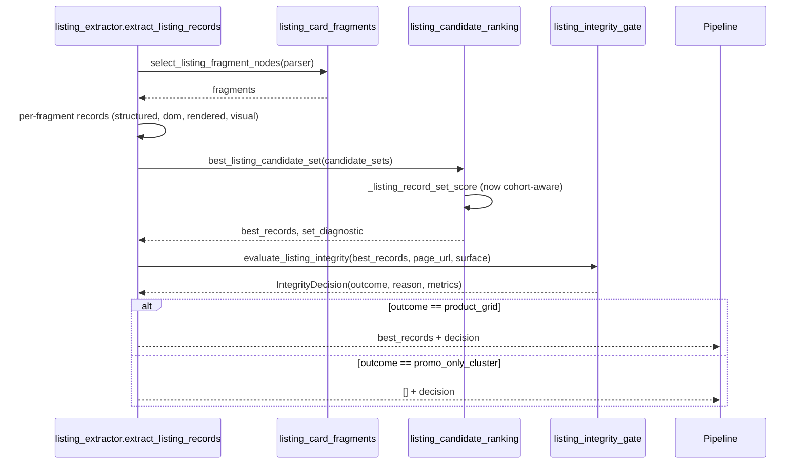
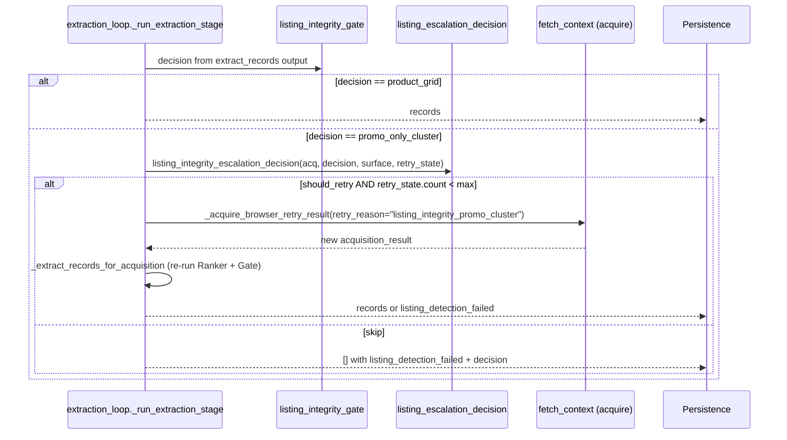

# Design Document

## Overview

This feature adds four architectural controls to the listing extraction and listing-side acquisition paths so that heterogeneous promo/hero clusters can no longer masquerade as product grids. The controls are generic across `ecommerce_listing` and `job_listing`:

1. A **grid-cohort (cluster-homogeneity) signal** in candidate-set scoring. Cohorts that share a dominant `Structural_Signature` score normally; heterogeneous clusters are penalized below the zero-record set.
2. A **generalized same-path-prefix sibling-category rejection** in `listing_url_is_structural`, driven entirely by `LISTING_CATEGORY_PATH_PREFIXES` and `LISTING_CATEGORY_PATH_SEGMENTS` under `Extraction_Rules_Config`.
3. A new **Listing_Integrity_Gate** that, after ranking, decides `product_grid` vs `promo_only_cluster` for the accepted candidate set and attaches a structured decision record.
4. A new **Acquisition_Escalator** for listing surfaces that, mirroring the detail field-aware retry decision owner, triggers at most one logged stronger-tier retry when the gate flags `promo_only_cluster` and a stronger tier is available under existing policy.

The feature is generic-first, respects `INVARIANTS.md` Rule 1 (config placement), Rule 2 (fix upstream), Rule 5 (user control ownership), Rule 6 (acquisition contract), Rule 7 (listing vs detail separation), and Rule 11 (codebase shape).

Design anchor: the concrete production failure is the Arcteryx `/ca/en/c/...` category page that returns three sibling-category promo tiles. Today the ranker prefers that three-row set over the zero-record set because each row carries a same-host URL and a title, so the run emits a false success. This design makes such a set lose to the empty set because (a) its Structural_Signature cohort is heterogeneous, (b) its URLs are same-prefix sibling categories, and (c) it has no detail markers and no support signals. Any one of those three predicates is already enough to reclassify the set as a `promo_only_cluster`.

### Research Notes And Sources

- Owner map from `docs/CODEBASE_MAP.md` Bucket 4 (Extraction) and Bucket 2 (Pipeline):
  - `backend/app/services/listing_extractor.py` — `_listing_record_from_card`, `extract_listing_records`.
  - `backend/app/services/extract/listing_candidate_ranking.py` — `best_listing_candidate_set`, `_listing_record_set_score`, `_listing_record_quality_metrics`, `_prepare_listing_candidate_set`.
  - `backend/app/services/extract/listing_card_fragments.py` — `base_listing_fragment_score`, `listing_node_signature`, `LISTING_FALLBACK_CONTAINER_SELECTOR`, `LISTING_STRUCTURE_POSITIVE_HINTS`.
  - `backend/app/services/extract/detail_identity.py` — `listing_url_is_structural`, `listing_detail_like_path`.
  - `backend/app/services/config/extraction_rules.py` — `LISTING_CATEGORY_PATH_PREFIXES`, `LISTING_CATEGORY_PATH_SEGMENTS`, `LISTING_STRUCTURE_POSITIVE_HINTS`, `LISTING_PRODUCT_DETAIL_ID_RE`, export export in `extraction_rules.exports.json`.
  - `backend/app/services/config/runtime_settings.py` — `listing_candidate_strong_score_threshold`, `listing_min_items`, `listing_fallback_fragment_limit`, `low_quality_browser_retry_min_remaining_seconds`, `low_quality_browser_retry_methods`.
  - `backend/app/services/pipeline/extraction_retry_decision.py` — `empty_extraction_browser_retry_decision`, `low_quality_extraction_browser_retry_decision` (shape to mirror).
  - `backend/app/services/pipeline/extraction_loop.py` — `_run_extraction_stage`, `_run_persistence_stage`, where `VERDICT_LISTING_FAILED` is emitted for listing surfaces.
  - `backend/app/services/publish/verdict.py` — `compute_verdict` and `VERDICT_LISTING_FAILED`.
- `docs/INVARIANTS.md` Rule 1 requires every new token and threshold to live under `app/services/config/`. Rule 7 forbids listing from falling back into single-record detail behavior. Rule 6 requires retries to be logged and bounded. Rule 5 forbids silent rewriting of user-controlled settings. Rule 11 forbids host/brand/site-specific branches in generic paths.
- `LISTING_CATEGORY_PATH_PREFIXES` already contains `/c/`. The `/{locale}/c/` shape is covered by the existing `listing_url_has_category_path_segment` / prefix match because both URLs compare normalized paths, not hosts; we still widen this owner to confirm prefix match after locale stripping.

## Architecture

### System Context

```mermaid
flowchart LR
    URL[Listing URL] --> ACQ[Acquisition]
    ACQ --> EXTR[extract_records]
    EXTR --> LR[extract_listing_records]
    LR --> CF[Listing_Card_Fragmenter<br/>signature per fragment]
    CF --> CR[Listing_Candidate_Ranker<br/>cohort-aware set score]
    CR --> IG[Listing_Integrity_Gate<br/>product_grid | promo_only_cluster]
    IG -->|product_grid| PERS[Persistence + verdict]
    IG -->|promo_only_cluster + stronger tier available| ESC[Acquisition_Escalator<br/>one retry]
    ESC --> ACQ
    IG -->|promo_only_cluster, no retry path| VF[listing_detection_failed<br/>+ diagnostic]
```

### Change Summary By Owner

| Owner | File | Change |
|---|---|---|
| Listing_Card_Fragmenter | `backend/app/services/extract/listing_card_fragments.py` | Extend existing `listing_node_signature` with a normalized `Structural_Signature(node, url)` helper. Pure function over fragment-local DOM attributes and URL shape. |
| Listing_Candidate_Ranker | `backend/app/services/extract/listing_candidate_ranking.py` | Add cohort-homogeneity ratio to `_listing_record_quality_metrics` (set-level). Extend `_listing_record_set_score` with a cohort penalty. Attach `cohort_penalty_applied` diagnostic through a new per-set diagnostic channel. |
| Detail_Identity | `backend/app/services/extract/detail_identity.py` | `listing_url_is_structural` already consults `LISTING_CATEGORY_PATH_PREFIXES`/`LISTING_CATEGORY_PATH_SEGMENTS`. Extend to the locale-prefixed form without introducing host tokens. Add a narrow carve-out so a locale-only shared leading segment does not by itself mark the candidate as a sibling. |
| Listing_Integrity_Gate | NEW `backend/app/services/extract/listing_integrity_gate.py` | Single entry point `evaluate_listing_integrity(ranked_records, page_url, surface) -> IntegrityDecision`. Pure function; no I/O; reads thresholds from `Runtime_Settings` and signals from `Extraction_Rules_Config`. |
| Listing_Extractor | `backend/app/services/listing_extractor.py` | After `best_listing_candidate_set`, invoke `evaluate_listing_integrity`. Return `([], promo_only_cluster_decision)` when the gate rejects. Thread the decision through to `extract_listing_records` via a typed result envelope. |
| extract_records | `backend/app/services/extraction_runtime.py` | Propagate the gate decision on the returned records (attached via a context-scoped diagnostic channel carried on `acquisition_result.browser_diagnostics` through the pipeline, not on individual records, so Rule 8 persistence invariants stay intact). |
| Acquisition_Escalator | NEW `backend/app/services/pipeline/listing_escalation_decision.py` | Pure decision function `listing_integrity_escalation_decision(acquisition_result, gate_decision, surface, run_retry_state)`. Returns `{should_retry, reason, prior_tier, next_tier}`. |
| extraction_loop | `backend/app/services/pipeline/extraction_loop.py` | Between extraction and persistence, for listing surfaces, call the escalator; on a trigger decision, reuse `_acquire_browser_retry_result` with `retry_reason="listing_integrity_promo_cluster"` and re-run `_extract_records_for_acquisition` once. Gate the re-run through `listing_integrity_retry_state` keyed by URL. |
| Extraction_Rules_Config | `backend/app/services/config/extraction_rules.py` + `extraction_rules.exports.json` | Add any new token/selector: `LISTING_CATEGORY_LOCALE_SEGMENT_PATTERN` (optional), and any hint used by Structural_Signature normalization. Export through the static JSON. |
| Runtime_Settings | `backend/app/services/config/runtime_settings.py` | Add numeric thresholds: `listing_cohort_homogeneity_min_ratio: float = 0.6`, `listing_integrity_min_records: int = 2`, `listing_integrity_escalation_enabled: bool = True`, `listing_integrity_escalation_retry_max_per_run: int = 1`. Defaults tuned so the Arcteryx promo cluster is rejected without tripping real low-volume product grids that already ship today. |

No changes to `publish/*`, `pipeline/persistence.py`, `pipeline/direct_record_fallback.py`, or `detail_extractor.py`.

### Placement Rationale

`Listing_Integrity_Gate` is a new file because there is no existing owner whose responsibility is "accept-or-reject the ranked set as a product grid." The ranker owns scoring, the extractor owns assembly, and the URL classifier owns per-URL structural classification. Placing the gate inside the ranker would cross concerns (ranking vs admission), and placing it inside the extractor would hide it from the listing-quality retry decision. It lives in `backend/app/services/extract/` because that is the listing-extraction bucket per `docs/CODEBASE_MAP.md`.

`Acquisition_Escalator` is placed alongside `extraction_retry_decision.py` because it is the same contract shape (pure decision function consumed by `extraction_loop.py`) and the detail field-aware retry decision already lives there. This satisfies Requirement 4.8 by reusing the owner bucket and public contract shape instead of introducing a parallel retry mechanism. The file is `listing_escalation_decision.py` to avoid extending the detail-focused module beyond its current detail-only purpose.

### Data Flow Inside Listing_Extractor



The only new object surfaced to callers is `IntegrityDecision`. Everything else stays typed through the existing dict/list record shapes used by `extraction_runtime.extract_records` and the pipeline.

### Retry Flow Inside extraction_loop



Retry state lives on the existing `URLProcessingContext` as `listing_integrity_retry_count: int = 0` and is incremented exactly once when the escalator triggers, so Requirement 4.5 (at most one retry per URL per run) is a property of the context object, not of the decision function alone.

## Components And Interfaces

### Structural_Signature (Listing_Card_Fragmenter)

```python
# backend/app/services/extract/listing_card_fragments.py

def listing_fragment_structural_signature(node, *, url: str) -> str:
    """
    Deterministic, fragment-local fingerprint used by the ranker's cohort check.

    Inputs are only fragment-local DOM features (tag, normalized class/id/role
    tokens, descendant-shape summary) and URL shape (path-prefix bucket,
    detail-marker boolean). No host, domain, or site-specific tokens.
    """
```

The signature is a stable hash of:

- Tag name (lowercased).
- Normalized `class`/`id`/`role` tokens filtered through `LISTING_STRUCTURE_POSITIVE_HINTS` and `LISTING_STRUCTURE_NEGATIVE_HINTS` so that site-specific class suffixes do not fragment the cohort.
- Descendant-shape summary: a 4-tuple `(anchor_count_bucket, img_count_bucket, price_signal, title_node_tag)` where each count is bucketed as `{0, 1, 2_5, 6_plus}` and `price_signal` is the boolean output of the existing `_extract_price_signal_from_card` equivalent check (price present / absent).
- URL shape: `(category_prefix_bucket, has_detail_marker)` where `category_prefix_bucket` is the first matching entry in `LISTING_CATEGORY_PATH_PREFIXES` or the empty string.

The function lives next to `listing_node_signature` and reuses it; it does not duplicate existing string-normalization helpers (INVARIANTS Rule 2).

### Listing_Candidate_Ranker (cohort-aware scoring)

```python
# backend/app/services/extract/listing_candidate_ranking.py

def _set_cohort_homogeneity(records, *, page_url) -> float:
    """Return dominant_signature_count / len(records). Empty set returns 1.0."""

def _set_cohort_penalty(homogeneity: float, *, threshold: float) -> int:
    """Return a large negative score delta when homogeneity < threshold, else 0."""
```

`_listing_record_set_score` stays a tuple-sort key but prepends a top-level `cohort_pass` boolean derived from the homogeneity check. A below-threshold set produces a score tuple strictly less than the zero-record baseline `(-1, -1, -1, -1, -1, -1, -1)` so `best_listing_candidate_set` picks the empty set over the penalized set. The existing utility-record rejection, editorial-URL rejection, and detail-like-merchandise logic stay in place; the cohort check is additive (Requirement 7.3).

A set diagnostic `cohort_penalty_applied` is attached to a new per-call diagnostic sink passed into `best_listing_candidate_set` via an optional `diagnostics_sink: list[dict]` kwarg. When omitted, diagnostics are silently dropped. `listing_extractor.extract_listing_records` supplies the sink and forwards it through to the gate and then to the caller on the returned typed envelope.

### Detail_Identity (sibling-category rejection extension)

`listing_url_is_structural` already consults `LISTING_CATEGORY_PATH_PREFIXES` and `LISTING_CATEGORY_PATH_SEGMENTS`. The extension is:

- Add a locale-aware prefix match: when the leading path segment of both URLs matches a locale pattern `r"^[a-z]{2}(?:[_-][a-z]{2})?$"` and the remaining path shares a `Category_Path_Prefix`, treat the candidate as sibling-category. The locale pattern itself lives in `Extraction_Rules_Config` as `LISTING_LOCALE_PATH_SEGMENT_PATTERN` so no regex literal stays in service code.
- Add a negative carve-out: when the only overlap between candidate and page URL is a locale-shaped leading segment (and no `Category_Path_Prefix` follows), the candidate is not treated as sibling on locale alone (Requirement 2.7).

`LISTING_CATEGORY_PATH_PREFIXES` already contains `/c/`; Requirement 2.4 additionally requires the locale-prefixed form to be covered. This is satisfied by the locale-aware match above; no new site-specific token is introduced.

### Listing_Integrity_Gate (new)

```python
# backend/app/services/extract/listing_integrity_gate.py

from dataclasses import dataclass

@dataclass(frozen=True)
class IntegrityDecision:
    outcome: str  # "product_grid" | "promo_only_cluster"
    reason: str   # short identifier for the triggering condition
    metrics: dict[str, int | float]  # see below


def evaluate_listing_integrity(
    records: list[dict[str, object]],
    *,
    page_url: str,
    surface: str,
) -> IntegrityDecision:
    ...
```

Decision rules, in order. The first match wins; remaining rules are still evaluated for diagnostic metric fill-in.

| Priority | Condition | Outcome | Reason |
|---|---|---|---|
| 1 | `len(records) < listing_integrity_min_records` | `promo_only_cluster` | `below_min_records` |
| 2 | cohort-homogeneity ratio `< listing_cohort_homogeneity_min_ratio` | `promo_only_cluster` | `cohort_heterogeneous` |
| 3 | every record URL is a `Sibling_Category_URL` of `page_url` | `promo_only_cluster` | `all_sibling_category_urls` |
| 4 | zero records carry a `Detail_Identity_Marker` AND zero support signals | `promo_only_cluster` | `no_support_signals` |
| 5 | otherwise | `product_grid` | `supported_set` |

Support signals are surface-derived (Requirement 9): for `ecommerce_listing` the set is `{image_url, price, rating, review_count, brand}`; for `job_listing` the set is `{company, location, salary, job_type}`. Both sets come from `Extraction_Rules_Config` / `field_mappings` (they are already defined as `LISTING_SUPPORT_FIELDS_BY_SURFACE` conceptually inside `listing_candidate_ranking._record_has_supporting_listing_signals`); the gate consumes a new exported constant `LISTING_INTEGRITY_SUPPORT_FIELDS` keyed by surface so the same vocabulary is shared by both owners without duplication.

`metrics` always contains:

- `record_count`
- `cohort_homogeneity_ratio`
- `dominant_signature_count`
- `sibling_category_count`
- `support_signal_count`
- `detail_marker_count`

The function is pure. It does not sort, dedupe, enrich, or mutate records (Requirement 3.7). It does not import from `publish/`, `pipeline/persistence.py`, `pipeline/direct_record_fallback.py`, adapter modules, or any export path (Requirement 7.1).

### Listing_Extractor wiring

```python
# backend/app/services/listing_extractor.py

def extract_listing_records(...) -> list[dict[str, Any]]:
    ...
    best_records = best_listing_candidate_set(...)
    decision = evaluate_listing_integrity(best_records, page_url=page_url, surface=surface)
    if decision.outcome == "promo_only_cluster":
        _attach_gate_decision_to_artifacts(artifacts, decision)
        return []
    _attach_gate_decision_to_artifacts(artifacts, decision)
    return best_records
```

The decision record travels on `acquisition_result.browser_diagnostics` (the existing diagnostic contract) under key `listing_integrity`. `extract_records` forwards it through via the pipeline's existing artifact channel, not by mutating individual records (INVARIANTS Rule 8).

When the outcome is `promo_only_cluster` and no retry is available, `extraction_loop._run_persistence_stage` already emits `VERDICT_LISTING_FAILED` for zero-record listing runs. The gate's decision is surfaced inside the URL metrics under `listing_integrity` and inside the `failure_reason` field (`failure_reason="promo_only_cluster"`). No change to `publish/verdict.py`; the existing verdict path already handles zero-record listing surfaces.

### Acquisition_Escalator (new decision module)

```python
# backend/app/services/pipeline/listing_escalation_decision.py

def listing_integrity_escalation_decision(
    acquisition_result,
    *,
    gate_decision,
    surface: str,
    retry_state,  # tracks per-URL per-run listing retries
    policy_snapshot,  # immutable snapshot derived from AcquisitionPolicy
) -> dict[str, object]:
    """
    Mirrors extraction_retry_decision.low_quality_extraction_browser_retry_decision.

    Returns:
        {
            "should_retry": bool,
            "reason": str,                 # listing_escalation_triggered | listing_escalation_skipped:<sub_reason>
            "prior_tier": str | None,
            "next_tier": str | None,
            "gate_reason": str,
            "candidate_summary": dict,
        }
    """
```

Decision rules:

1. If `surface` does not start with `ecommerce_listing` or `job_listing` -> skip, reason `not_listing_surface`.
2. If `gate_decision.outcome != "promo_only_cluster"` -> skip, reason `gate_ok`.
3. If `retry_state.listing_integrity_retry_count >= listing_integrity_escalation_retry_max_per_run` -> skip, reason `already_retried`.
4. If `effective_blocked(acquisition_result)` -> skip, reason `blocked`.
5. If policy has flagged a challenge or disabled escalation -> skip, reason pulled from existing `AcquisitionPolicy` reason set (`challenge_state`, `escalation_disabled`, `host_hard_block`).
6. Compute `next_tier`:
   - current `method=="curl_cffi"` or `method=="httpx"` -> `next_tier="browser:chromium"`
   - current `method=="browser"` and `browser_engine=="patchright"` and `real_chrome_browser_available()` -> `next_tier="browser:real_chrome"`
   - current `method=="browser"` and `browser_engine=="chromium"` and `real_chrome_browser_available()` -> `next_tier="browser:real_chrome"`
   - otherwise -> skip, reason `no_stronger_tier` (Requirement 4.2).
7. Otherwise `should_retry=True`, reason `promo_only_cluster`, diagnostic keys filled.

The function reuses `effective_blocked` from `pipeline.runtime_helpers`, `real_chrome_browser_available` from `acquisition.browser_runtime`, and the policy snapshot constructor from `AcquisitionPolicy`. No new acquisition primitives are introduced (Requirement 4.8).

### extraction_loop wiring

```python
# backend/app/services/pipeline/extraction_loop.py, inside _run_extraction_stage

records, selector_rules = await _retry_low_quality_extraction_with_browser(...)
records, selector_rules = await _retry_listing_integrity_with_stronger_tier(
    context,
    fetched,
    records=records,
    selector_rules=selector_rules,
)
```

`_retry_listing_integrity_with_stronger_tier` calls `listing_integrity_escalation_decision`, logs the event through `_log_pipeline_event`, and on `should_retry` invokes the existing `_acquire_browser_retry_result(retry_reason="listing_integrity_promo_cluster", forced_browser_engine=...)`. After the retry, it re-runs `_extract_records_for_acquisition`, which re-invokes the Ranker and Gate on the new observation (Requirement 4.6). The per-URL counter on `URLProcessingContext` prevents more than one retry regardless of gate outcome on the retried fetch (Requirement 4.5).

User controls (`surface`, `llm_enabled`, traversal intent, proxy, diagnostics-capture) are read-only inputs to the retry profile. They are never modified (Requirements 4.7, 6.1–6.4). When `diagnostics_profile.capture_screenshot == False`, the retry inherits the same profile via the existing `_build_acquisition_request` path; no new screenshot path is introduced. When `llm_enabled == False`, the gate and escalator never invoke `llm_runtime` or any LLM entry point (Requirement 6.5); the gate and escalator do not import `llm_runtime` at all.

## Data Models

### Structural_Signature

```python
# Deterministic string key; shape-only, no site tokens.
# Format: "{tag}|{positive_class_bucket}|{anchor_count_bucket}|{img_count_bucket}|{price_signal}|{title_tag}|{url_prefix_bucket}|{has_detail_marker}"
# Example: "article|product-card|1|1|price|h2|/c/|0"
```

### IntegrityDecision

```python
@dataclass(frozen=True)
class IntegrityDecision:
    outcome: Literal["product_grid", "promo_only_cluster"]
    reason: Literal[
        "below_min_records",
        "cohort_heterogeneous",
        "all_sibling_category_urls",
        "no_support_signals",
        "supported_set",
    ]
    metrics: dict[str, int | float]
```

### Escalation decision payload

```python
{
    "should_retry": bool,
    "reason": str,       # e.g. "promo_only_cluster" | "already_retried" | "no_stronger_tier"
                         # | "blocked" | "challenge_state" | "escalation_disabled" | "gate_ok"
    "prior_tier": str | None,  # "curl_cffi" | "httpx" | "browser:chromium" | "browser:patchright"
    "next_tier": str | None,   # "browser:chromium" | "browser:real_chrome" | None
    "gate_reason": str,
    "candidate_summary": {
        "record_count": int,
        "cohort_homogeneity_ratio": float,
        "sibling_category_count": int,
        "support_signal_count": int,
    },
}
```

### Diagnostics Fields On acquisition_result.browser_diagnostics

| Key | Owner | When |
|---|---|---|
| `listing_integrity.decision` | Listing_Integrity_Gate | Always set on listing surfaces after extraction |
| `listing_integrity.cohort_penalty_applied` | Listing_Candidate_Ranker | When any set incurred a cohort penalty |
| `listing_escalation_triggered` | Acquisition_Escalator | When retry is triggered |
| `listing_escalation_skipped` | Acquisition_Escalator | When retry is skipped, with reason |
| `failure_reason` | extraction_loop | Set to `promo_only_cluster` when gate drives the zero-record verdict |

## Correctness Properties

*A property is a characteristic or behavior that should hold true across all valid executions of a system-essentially, a formal statement about what the system should do. Properties serve as the bridge between human-readable specifications and machine-verifiable correctness guarantees.*

### Property 1: Structural signature is deterministic and shape-sensitive

*For any* fragment node and URL pair `(node, url)`, calling `listing_fragment_structural_signature` twice on equal shape-tuples yields the same string, and changing any contributing dimension (tag name, positive-class bucket, anchor/image count bucket, price signal, title-node tag, category-prefix bucket, or detail-marker boolean) changes the output.

**Validates: Requirements 1.1**

### Property 2: Cohort-homogeneity ratio equals dominant-signature fraction

*For any* non-empty list of signatures, `cohort_homogeneity_ratio == count_of_mode(signatures) / len(signatures)`, the result is in the closed interval `[0, 1]`, and equals `1.0` exactly when all signatures are equal.

**Validates: Requirements 1.2**

### Property 3: Heterogeneous below-threshold set never outranks zero-record set

*For any* candidate set `S` whose cohort-homogeneity ratio is strictly less than `listing_cohort_homogeneity_min_ratio`, the penalized score returned by `_listing_record_set_score(S)` is strictly less than the score of the empty set, and `best_listing_candidate_set` over any pair containing `S` and an empty set picks the empty set.

**Validates: Requirements 1.3, 1.4**

### Property 4: Sibling-category rejection by shared prefix or segment

*For any* `(page_url, candidate_url)` where both share a configured `Category_Path_Prefix` from `LISTING_CATEGORY_PATH_PREFIXES` or a `LISTING_CATEGORY_PATH_SEGMENT`, the candidate path differs from the page path, and the candidate carries no `Detail_Identity_Marker`, `listing_url_is_structural(candidate_url, page_url)` returns `True`.

**Validates: Requirements 2.1, 2.2, 2.6**

### Property 5: Detail_Identity_Marker exempts candidate from prefix-only rejection

*For any* `(page_url, candidate_url)` where the candidate carries a `Detail_Identity_Marker`, `listing_url_is_structural` does not return `True` solely on the basis of a shared `Category_Path_Prefix`.

**Validates: Requirements 2.3**

### Property 6: Locale-only shared leading segment is not a sibling signal

*For any* `(page_url, candidate_url)` whose only shared leading segment matches `LISTING_LOCALE_PATH_SEGMENT_PATTERN` and whose remaining paths share no `Category_Path_Prefix`, the candidate is not classified as a `Sibling_Category_URL`.

**Validates: Requirements 2.7**

### Property 7: Gate decision truth table matches documented rules

*For any* `(records, page_url, surface)`, the outcome returned by `evaluate_listing_integrity` is `promo_only_cluster` if and only if at least one of these conditions holds: `len(records) < listing_integrity_min_records`; cohort-homogeneity ratio below `listing_cohort_homogeneity_min_ratio`; every record URL is a `Sibling_Category_URL`; zero detail markers AND zero support signals for the active surface.

**Validates: Requirements 3.2, 3.3, 3.4, 3.5, 3.9**

### Property 8: Gate is non-mutating

*For any* input `records` list, the list identity, order, element identity, and element contents are byte-for-byte unchanged after `evaluate_listing_integrity` returns.

**Validates: Requirements 3.7**

### Property 9: Zero-record listing verdict is consistent across all triggers

*For any* listing-surface run that yields zero supported records, the final verdict is `listing_detection_failed`. If the zero count was driven by the gate, the `failure_reason` is `promo_only_cluster` and the diagnostic carries the `IntegrityDecision`; otherwise the diagnostic reflects the pre-existing zero-record reason. In neither case does the listing run persist a single-record detail-like row.

**Validates: Requirements 3.6, 7.4, 7.5**

### Property 10: Escalator decision is a pure function of gate, tier, and policy

*For any* tuple `(gate_decision, surface, acquisition_result, retry_state, policy_snapshot)`, `listing_integrity_escalation_decision` returns `should_retry=True` if and only if all of these hold: `surface` is a listing surface; `gate_decision.outcome == "promo_only_cluster"`; `retry_state.count < max`; acquisition is not blocked; policy is not in challenge/escalation-disabled state; a stronger tier exists. Otherwise it returns `should_retry=False` with a reason drawn from the canonical reason set `{gate_ok, not_listing_surface, already_retried, blocked, challenge_state, escalation_disabled, host_hard_block, no_stronger_tier}`.

**Validates: Requirements 4.1, 4.2, 4.3**

### Property 11: At most one listing-quality retry per URL per run

*For any* sequence of gate outcomes on the same URL within a single run, the escalator triggers at most one listing-quality retry, regardless of gate outcome on the retried fetch, and subsequent gate rejections re-emit `listing_detection_failed` without additional retries.

**Validates: Requirements 4.5, 4.6**

### Property 12: Gate and Escalator do not mutate user controls and never call LLM when disabled

*For any* run settings (`surface`, `llm_enabled`, traversal intent, proxy list, diagnostics-capture profile), running the gate and escalator to completion leaves every user-controlled setting byte-for-byte unchanged, and when `llm_enabled == False` neither component invokes any LLM entry point.

**Validates: Requirements 4.7, 6.1, 6.2, 6.3, 6.4, 6.5**

### Property 13: Diagnostic retention preserves set-level and gate-level decisions independently

*For any* candidate-set evaluation that incurred a cohort penalty, both the `cohort_penalty_applied` diagnostic and the `IntegrityDecision` record are present in the pipeline's diagnostics channel, and neither is erased, replaced, or overwritten by the other.

**Validates: Requirements 8.1, 8.2, 8.4, 8.5**

### Property 14: Diagnostic payload shape for escalation events matches the acquisition diagnostics contract

*For any* escalation decision, the emitted `listing_escalation_triggered` or `listing_escalation_skipped` event contains `prior_tier`, `next_tier`, `gate_reason`, and `candidate_summary`; fields are drawn from the existing acquisition diagnostics contract and no new field is introduced that the contract does not already recognize.

**Validates: Requirements 4.4, 8.3**

### Property 15: Cross-surface uniformity on equivalent inputs

*For any* record set with surface-appropriate support signals, `evaluate_listing_integrity` returns decisions that differ across `ecommerce_listing` and `job_listing` only in the identity of the support-signal vocabulary consulted, and the escalator applies the same contract to both surfaces.

**Validates: Requirements 9.1, 9.2, 9.3, 9.4, 9.5**

## Error Handling

### Malformed or empty candidate sets

- An empty `records` list returns `IntegrityDecision(outcome="promo_only_cluster", reason="below_min_records", ...)` and never raises.
- A records list where every entry is missing `url` or `title` trips the existing `listing_record_supported` filter before reaching the gate; the gate still receives the pruned list and returns `below_min_records` when the count falls under threshold.

### Bad URLs

- `urlsplit` failures inside `listing_url_is_structural` are already caught and logged at `DEBUG`. The new locale-aware branch inherits that exception handling; a parse failure falls through to the existing default behavior (treat as not structural).

### Acquisition errors during escalation

- The escalator does not perform acquisition itself; it only decides. The retry is executed by the existing `_acquire_browser_retry_result`, whose `except (RuntimeError, ValueError, TypeError, OSError)` path is already wired into `_merge_browser_diagnostics` with `build_failed_browser_diagnostics`. Failed retries are logged at `warning` and the pre-retry decision stands (verdict remains `listing_detection_failed` with `failure_reason="promo_only_cluster"`).
- `real_chrome_browser_available()` returning `False` for a requested real-Chrome escalation collapses the decision to `should_retry=False, reason="no_stronger_tier"` deterministically, so the run is not stalled.

### Budget exhaustion

- Before invoking `_acquire_browser_retry_result`, `_retry_listing_integrity_with_stronger_tier` reuses the existing `_remaining_url_budget_seconds` / `_browser_retry_min_remaining_seconds` guard used by the low-quality detail retry. When the remaining budget is below the minimum, the escalator emits `listing_escalation_skipped` with reason `budget_exhausted` and the gate's `listing_detection_failed` verdict stands.

### Diagnostic channel contention

- The gate writes a single decision record per URL under a fixed key. If the key is already present (e.g. on a retry), the new record replaces the old one and the prior record is preserved under `listing_integrity.previous` so that both can be audited (Requirement 8.5 across retries).

## Testing Strategy

### Testing Approach

- **Unit tests** cover specific examples and edge cases:
  - The Arcteryx promo-cluster regression: three sibling-category tiles under `/ca/en/c/...` rank below the zero-record set.
  - Locale-only URL pairs do not trip the sibling-category rule.
  - Detail-marker-bearing URLs pass structural classification despite shared prefixes.
  - Architectural lint: `listing_integrity_gate.py` and `listing_escalation_decision.py` contain no literal host, domain, brand, CDN, or site identifier, and do not import from `publish/`, `pipeline/persistence.py`, `pipeline/direct_record_fallback.py`, or `detail_extractor.py`.
  - Config placement: every new token/threshold is sourced from `Extraction_Rules_Config` or `Runtime_Settings`, and the new tokens appear in `extraction_rules.exports.json`.

- **Integration tests** cover the pipeline wiring:
  - A listing run that produces a promo-only cluster emits `VERDICT_LISTING_FAILED` with `failure_reason="promo_only_cluster"` and the gate decision on `url_metrics.listing_integrity`.
  - When a stronger tier is available, the retry is triggered exactly once and re-runs extraction on the new observation.
  - When no stronger tier is available, the retry is skipped with reason `no_stronger_tier` and the verdict still lands.

- **Property-based tests** cover the universal properties above. The property test library is Hypothesis (already standard in this repo for similar extraction invariants). Each property test:
  - Runs a minimum of 100 iterations.
  - Is tagged with a comment of the form `# Feature: listing-product-grid-integrity, Property {number}: {property_text}` immediately above the test function.
  - Implements exactly one design property.

### When PBT Applies

PBT is appropriate here because:

- `listing_fragment_structural_signature`, `_set_cohort_homogeneity`, `_set_cohort_penalty`, `evaluate_listing_integrity`, and `listing_integrity_escalation_decision` are pure functions over input records, URLs, and policy snapshots.
- The input space is large and structured (arbitrary record lists, URL shapes, signature compositions) and input variation exposes edge cases (empty sets, all-sibling sets, mixed support signals, boundary ratios).
- External dependencies (acquisition, browser runtime, LLM) are isolated behind decision functions, so PBT can exercise the logic with policy snapshots and mocked observation objects without paying for real fetches.

### When PBT Does Not Apply

- The actual acquisition retry is an integration test concern (real fetch behavior varies with network). Those tests use 1–3 representative examples and do not iterate.
- Pipeline wiring (hooking the gate and escalator into `extraction_loop.py`) is covered by integration tests that exercise `process_single_url` end-to-end with a stubbed acquisition result.
- Config-placement and architectural-lint checks are example-based (static content greps) rather than property-based.

### Test File Locations

- `backend/tests/services/extract/test_listing_card_fragments_signature.py` — Property 1.
- `backend/tests/services/extract/test_listing_candidate_ranking_cohort.py` — Properties 2, 3, 13.
- `backend/tests/services/extract/test_detail_identity_sibling_category.py` — Properties 4, 5, 6.
- `backend/tests/services/extract/test_listing_integrity_gate.py` — Properties 7, 8, 15.
- `backend/tests/services/pipeline/test_listing_escalation_decision.py` — Properties 10, 14.
- `backend/tests/services/pipeline/test_listing_integrity_pipeline.py` — Properties 9, 11, 12 (integration-style, but asserted universally over generated gate outcomes and run settings).

### Regression Tests

Two regression tests ship alongside the PBT suite:

1. A fixture capturing the Arcteryx `/ca/en/c/...` HTML slice: the gate classifies the three tiles as `promo_only_cluster` with `reason="all_sibling_category_urls"`, and the verdict is `listing_detection_failed`.
2. A fixture capturing a real product grid (≥ 20 homogeneous product cards): the gate classifies the set as `product_grid` and the pre-existing verdict behavior is unchanged.

These two regression tests protect against both over-rejection (false negatives on real grids) and under-rejection (the original bug).
