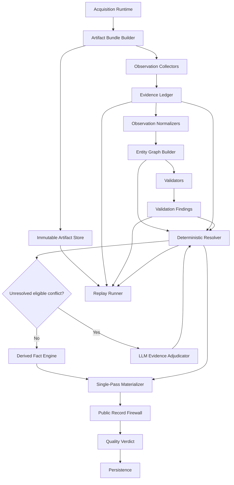

# CrawlerAI Final Extraction Architecture Design

**Repository:** `abhij1306/CrawlerAI`  
**Reviewed branch:** `main`  
**Reviewed commit:** `fa385fd01972109d84bfbf97a49cf5b8361ca38a`  
**Purpose:** Authoritative architecture contract for Codex to use when drafting the implementation plan.

---

## 1. Review coverage and access

The current repository was directly reviewed at the commit above. All existing files explicitly referenced in this design were accessible:

- `backend/app/services/extract/contracts.py`
- `backend/app/services/extract/detail/assembly/candidate_collection.py`
- `backend/app/services/extract/detail/assembly/candidate_materialization.py`
- `backend/app/services/extract/detail/assembly/record_assembly.py`
- `backend/app/services/extract/detail/assembly/final_cleanup.py`
- `backend/app/services/extract/detail/resolution.py`
- `backend/app/services/extract/detail/validation.py`
- `backend/app/services/publish/verdict.py`
- `backend/app/services/observability/run_trace.py`
- `backend/app/services/acquisition/browser_capture.py`
- `backend/app/services/pipeline/persistence.py`
- `backend/app/services/artifact_store.py`
- `docs/CODEBASE_MAP.md`

Files marked **new** below do not exist yet and are part of the target architecture. Codex does not need to repeat the architecture investigation; it should inspect individual functions only to create implementation slices, tests, and patches.

---

## 2. Final architectural decision

CrawlerAI remains a **modular monolith**. Keep the acquisition runtime, browser pool, adapters, structured-source parsing, JavaScript-state extraction, network capture, pipeline orchestration, storage abstraction, and public-record firewall.

Replace the detail extraction decision core.

### Current decision flow

```text
collect field candidates
    -> rank primarily by source
    -> materialize a flat record
    -> repeatedly sanitize, backfill, reconcile, repair and mutate it
    -> validate after mutation
    -> report success when a record exists
```

### Target decision flow

```text
acquire immutable artifacts
    -> collect immutable observations
    -> normalize observations
    -> build product/variant/offer entity graph
    -> validate observations and entities
    -> resolve evidence into entity facts
    -> create explicit derived facts
    -> materialize the public record once
    -> apply quality-aware verdict
    -> persist replayable artifacts, evidence and decisions
```

The public response schema may remain backward compatible. The internal model must no longer treat ecommerce extraction as independent field selection.

---

## 3. Current-state diagnosis

### 3.1 Source priority still drives selection

`candidate_materialization.py` orders candidates using source rank, groups by source, and normally selects the first source group. Field-specific exceptions do not solve whether a value belongs to the requested product, a variant, another locale, a seller offer, or a recommendation card.

Source priority must become only a late deterministic tie-breaker.

### 3.2 Evidence-shaped records lack semantic ownership

`RawCandidate` already has `entity_ref`, `entity_scope`, `confidence`, `source_locator`, and metadata, but the common admission path normally stores generic locators and leaves meaningful entity and request-context information empty.

### 3.3 The flat record is created too early

`candidate_collection.py` materializes the product record before semantic resolution. `final_cleanup.py` then performs sanitization, DOM backfill, variant normalization and pruning, currency reconciliation, price magnitude repair, parent/variant price repair, money repair, entity mutation, public-contract enforcement, and validation.

This produces an unstable chain:

```text
choose -> mutate -> derive -> repair -> mutate again -> validate
```

### 3.4 Resolution mutates dictionaries

`detail/resolution.py` changes the already materialized product and variant dictionaries in place. A real resolver must consume immutable evidence and return explicit decisions without modifying its inputs.

### 3.5 Validation and lineage are too coarse

Validation runs after repair and often links a finding to field-level winners, not the exact parent and variant observations that caused the conflict. Variant lineage currently attaches broad evidence to rows instead of exact row-field lineage.

### 3.6 Success is not quality-aware

`publish/verdict.py` reports success whenever `record_count > 0` and the page is not blocked. Identity-only or contradictory records can therefore be reported as successful.

### 3.7 Heuristic growth will continue without a semantic core

Recent changes continue adding fallback values, domain mappings, low-signal lists, and special extraction rules. Domain knowledge is useful, but it must feed observations, validators, resolver policies, or domain profiles rather than an expanding post-materialization mutation chain.

---

## 4. Mandatory architecture principles

1. **Artifacts are immutable.** Raw/rendered HTML, JSON-LD, JS state, network responses, screenshots, and request context are replayable inputs.
2. **Observations are append-only.** Extractors emit evidence; they do not overwrite one another or edit the final record.
3. **Entity ownership precedes value selection.** Values are compared only after product, variant, offer, option, and asset ownership is established.
4. **Commercial facts remain composite.** Price, currency, availability, seller, locale, and effective time belong to one `Offer` context.
5. **Validators report; they do not repair.** Validators produce findings with exact evidence and entity IDs.
6. **Resolution is deterministic by default.** Same artifacts and versions must produce byte-identical decisions and output.
7. **Every public value is explainable.** It links to direct evidence or to a derived fact that links to its inputs and rule.
8. **Materialization happens once.** After materialization, only syntactic public-schema shaping is allowed.
9. **LLMs adjudicate; they do not invent.** They may select/reject/abstain over supplied evidence IDs only.
10. **A non-empty record is not automatically successful.** Verdict is based on evidence sufficiency and findings.

---

## 5. Target component flow



---

## 6. Core contracts

## 6.1 `ArtifactBundle`

One bundle represents the complete acquisition context for one processed URL.

```python
class ArtifactBundle(BaseModel):
    schema_version: str
    bundle_id: str
    run_id: int
    requested_url: str
    final_url: str
    redirect_chain: list[RedirectHop]
    request_context: RequestContext
    artifacts: list[ArtifactRef]
    capture_started_at: datetime
    capture_completed_at: datetime
    acquisition_outcome: str
    acquisition_diagnostics: dict[str, Any]
```

Supported artifact types:

```text
http_html
rendered_html
sanitized_dom_snapshot
json_ld_document
microdata_document
open_graph_document
js_state_document
network_response
screenshot
browser_diagnostics
```

Absence or truncation must be explicit in the manifest.

`bundle_id` should be deterministic from the requested/final URL, request-context fingerprint, sorted artifact hashes, and artifact schema version.

## 6.2 `RequestContext`

```python
class RequestContext(BaseModel):
    request_context_id: str
    browser_engine: str | None
    browser_profile_id: str | None
    user_agent_family: str | None
    locale: str | None
    language: str | None
    timezone: str | None
    country_hint: str | None
    proxy_country: str | None
    currency_hint: str | None
    cookie_state_fingerprint: str | None
    storage_state_fingerprint: str | None
    session_id: str | None
    captured_at: datetime
```

Request context is first-class because locale/session differences directly affect price, currency, availability, and selected variant.

## 6.3 `ArtifactRef`

```python
class ArtifactRef(BaseModel):
    artifact_id: str
    artifact_type: str
    content_sha256: str
    storage_uri: str
    media_type: str
    byte_length: int
    captured_at: datetime
    parent_artifact_id: str | None
    metadata: dict[str, Any]
```

Network-response metadata should include stable `response_id`, `request_id`, request-context ID, URL, method, status, safe headers, resource type, frame URL, initiator/parent request when available, redirect relationship, endpoint family, timestamp, and body hash.

## 6.4 `Observation`

Replace generic sequence-based field candidates with immutable observations.

```python
class Observation(BaseModel):
    schema_version: str
    evidence_id: str
    bundle_id: str
    artifact_id: str
    request_context_id: str
    extractor_id: str
    extractor_version: str

    fact_type: str
    raw_value: Any
    normalized_value: Any | None

    source_type: str
    source_locator: SourceLocator
    observed_entity_hint: EntityHint | None

    directness: Literal["direct", "embedded", "inherited_hint", "derived_hint"]
    confidence_signals: dict[str, float]
    quality_flags: list[str]
    metadata: dict[str, Any]
```

Example `fact_type` values:

```text
product.title
product.brand
product.description
product.category
product.sku
variant.sku
variant.axis_label
variant.option_value
offer.price
offer.currency
offer.availability
offer.original_price
asset.image_url
relationship.selected_variant
relationship.product_variant
```

### Stable evidence identity

Do not use `ev_000001` as the durable ID. Generate `evidence_id` from a canonical hash of:

```text
bundle ID
artifact ID
extractor ID and version
fact type
source locator
entity hint
normalized value
```

A short sequence ID may be retained only for UI display.

## 6.5 `SourceLocator`

```python
class SourceLocator(BaseModel):
    locator_type: Literal[
        "json_pointer", "css_selector", "xpath", "script_path",
        "network_json_pointer", "response_header", "url_component",
        "adapter_path", "text_span"
    ]
    locator: str
    start_offset: int | None
    end_offset: int | None
    context_preview: str | None
```

Use exact JSON pointers, selectors, script paths, or text spans rather than generic labels.

## 6.6 Entity graph

Required node types:

```text
ProductEntity
VariantEntity
OptionAxisEntity
OptionValueEntity
OfferEntity
AssetEntity
SellerEntity (optional initially, required for marketplace evolution)
```

Required edges:

```text
HAS_VARIANT
HAS_OPTION_AXIS
HAS_OPTION_VALUE
REPRESENTS_SELECTION
HAS_OFFER
HAS_ASSET
SELECTED_VARIANT
SAME_AS
POSSIBLY_SAME_AS
CONTRADICTS
DERIVED_FROM
```

```python
class EntityNode(BaseModel):
    entity_id: str
    entity_type: str
    identity_keys: list[IdentityKey]
    evidence_ids: list[str]
    request_context_ids: list[str]
    attributes: dict[str, list[str]]  # fact type -> evidence IDs
    status: str
```

The graph must support several product-like clusters on one page without merging recommendation or analytics objects into the requested product.

## 6.7 `ValidationFinding`

```python
class ValidationFinding(BaseModel):
    finding_id: str
    rule_id: str
    rule_version: str
    severity: Literal["info", "low", "medium", "high", "critical"]
    category: Literal[
        "identity", "scope", "completeness", "contradiction",
        "context", "commercial", "structural", "quality"
    ]
    entity_ids: list[str]
    evidence_ids: list[str]
    fact_types: list[str]
    message: str
    metadata: dict[str, Any]
    blocking: bool
```

## 6.8 `ResolutionDecision`

```python
class ResolutionDecision(BaseModel):
    decision_id: str
    resolver_version: str
    entity_id: str
    fact_type: str
    candidate_evidence_ids: list[str]
    accepted_evidence_ids: list[str]
    rejected: list[RejectedEvidence]
    finding_ids: list[str]
    decision_rule: str
    decision_score_components: dict[str, Any]
    status: Literal["resolved", "unresolved", "conflicted", "abstained"]
    llm_adjudication_id: str | None
```

Precise rejection reason codes must include:

```text
wrong_entity
wrong_request_context
cross_sell_cluster
identity_mismatch
incomplete_composite_offer
contradicted_by_direct_evidence
invalid_value
low_signal_value
inherited_when_direct_exists
less_complete
lower_reliability
lower_source_priority_tiebreak
duplicate_semantic_value
```

## 6.9 `DerivedFact`

Derived values are explicit facts, not silent mutations.

```python
class DerivedFact(BaseModel):
    derived_fact_id: str
    rule_id: str
    rule_version: str
    entity_id: str
    fact_type: str
    value: Any
    input_evidence_ids: list[str]
    input_decision_ids: list[str]
    finding_ids: list[str]
    metadata: dict[str, Any]
```

Examples include normalized money precision, parent availability from a known-complete variant set, or product material from unanimous direct variant evidence.

---

## 7. Extraction stages

## 7.1 Acquisition and artifact freezing

Keep the existing acquisition stack. At acquisition completion, persist an `ArtifactBundle` manifest before extraction starts.

Required behavior:

1. Persist raw HTTP and rendered HTML separately.
2. Persist captured JSON/network bodies through content-addressed storage.
3. Persist request-context metadata.
4. Persist safe browser diagnostics and screenshot references.
5. Record missing/truncated artifacts explicitly.
6. Never mutate stored artifacts downstream.

Extend the storage interface rather than binding the design to local filesystem paths.

## 7.2 Pure observation collectors

```python
class ObservationCollector(Protocol):
    collector_id: str
    collector_version: str

    def collect(self, bundle: ArtifactBundle) -> list[Observation]:
        ...
```

Collectors:

```text
adapter
network payload
JSON-LD
microdata
OpenGraph
JavaScript state
DOM semantic
DOM selector
URL identity
table/specification
```

Collectors may parse and perform local syntactic normalization. They must not read or modify a partially materialized record, suppress other collectors, or depend on collector order.

Site-specific recipes belong inside collectors or domain profiles and must still emit normal observations with provenance.

## 7.3 Observation normalization

Normalization standardizes representation without deciding truth.

Examples:

```text
"$1,299.00" -> Decimal("1299.00")
"aud" -> "AUD"
"InStock" -> "in_stock"
tracking URL -> canonical URL while preserving original metadata
```

Normalization must not infer missing currency, change price magnitude because another price differs, assign a variant fact to the product, or drop a candidate because a higher-priority source exists. Semantic changes are `DerivedFact` operations.

## 7.4 Primary product clustering

Pages may contain the requested product, recommendations, recently viewed products, analytics objects, parent/child products, and multiple sellers. Cluster observations before selecting the primary product.

Identity signals, strongest first:

1. exact canonical product ID, variant ID, SKU, GTIN, or MPN;
2. exact/compatible requested or final URL identity;
3. structured `mainEntity` or primary-page relationship;
4. selected-variant URL/state relationship;
5. title and model-code compatibility;
6. primary DOM content region;
7. common artifact subtree/network object;
8. weak textual similarity.

Recommendation/cross-sell context is negative evidence. If the requested product cluster cannot be resolved confidently, return `review` or `empty`; do not merge all product objects.

## 7.5 Variant and option graph

### Variant identity hierarchy

Merge variant observations using:

1. exact `variant_id`;
2. exact SKU;
3. exact canonical variant URL/stable variant query;
4. exact structured product/offer ID;
5. exact option-axis tuple within the same product and request context;
6. compatible option tuple plus matching offer/asset identity.

Never merge variants only because they share a price, image, or one option value.

### Axis classification precedes expansion

Use label text, ARIA label, fieldset legend, control/form name, data attributes, nearby headings, option grammar, swatch behavior, URL/state changes, stock/price changes, and cross-source agreement.

Axis types:

```text
size, color, material, style, width, length, capacity,
quantity, pack, configuration, unknown
```

Numeric values are not automatically sizes. Quantity/pack controls become variant axes only when they identify distinct sellable SKUs/offers.

### No unsupported Cartesian products

Create combinations only when an explicit variation matrix, network list, JS-state table, or verified DOM state transition proves the combinations exist. Otherwise preserve partial option evidence without inventing rows.

## 7.6 Offer construction

An offer is atomic and scoped to a product/variant, seller, request context, and effective time.

Offer facts:

```text
price, currency, original_price, availability, stock_quantity,
seller, locale, tax/shipping qualification when captured
```

Never combine price and currency across different entity IDs, request contexts, sellers, observation groups, or effective times.

### Parent price policy

1. Direct product-level offer for the requested context.
2. Direct offer of an explicitly selected variant.
3. Derived product price only when output semantics are unambiguous.

Do not blindly use minimum variant price. If a real range exists and the public contract supports only one price, either add supported `price_min`/`price_max` fields or omit the exact price and degrade the verdict. Do not publish a false exact price.

### Parent availability policy

Prefer direct product-level availability. Variant-derived availability is allowed only when the variant set is known complete or the requested/selected variant is explicit and output semantics refer to it.

### Parent currency policy

Locale/domain inference may create a derived currency fact only with an explicit rule and supporting context. It must not silently overwrite direct currency evidence.

---

## 8. Validation architecture

Validators run before final resolution and produce findings only.

### Identity validators

- requested versus final URL/product identity;
- requested product versus selected cluster;
- SKU/variant ID collisions;
- incompatible title/model-code clusters;
- cross-sell contamination.

### Scope validators

- product fact attached to variant-only evidence;
- fact attached to the wrong variant;
- asset belonging to another entity;
- product consensus attempted from incomplete variants.

### Offer validators

- price without currency or currency without price;
- parent/variant currency contradiction;
- original price below current price;
- negative stock;
- sellable variant without coherent offer;
- mixed request-context offer;
- seller conflict;
- unexplained magnitude contradiction.

### Variant validators

- duplicate identity;
- same SKU with contradictory option tuples;
- unsupported Cartesian expansion;
- quantity classified as size;
- row missing commercial identity;
- selected variant absent from graph;
- incomplete row-field lineage.

### Output validators

- minimum detail knowledge;
- required identity/offer contract;
- public value without evidence;
- blocking finding linked to a published value;
- internal field leakage.

---

## 9. Resolver architecture

The resolver consumes:

```text
EvidenceLedger + EntityGraph + ValidationFindings + ResolverPolicy
```

and returns a pure `ResolutionResult`.

```python
class ResolutionResult(BaseModel):
    resolver_version: str
    primary_product_entity_id: str | None
    decisions: list[ResolutionDecision]
    derived_facts: list[DerivedFact]
    unresolved_fact_types: list[str]
    blocking_finding_ids: list[str]
    diagnostics: dict[str, Any]
```

### Ranking order

For each entity/fact:

1. admissibility;
2. exact entity identity/scope;
3. request-context compatibility;
4. composite coherence;
5. directness;
6. validation result;
7. completeness;
8. measured extractor reliability by fact/domain;
9. configured source priority as a late tie-breaker;
10. stable evidence-ID tie-break for determinism.

### Fact-family policies

Do not use one generic winner function for all fields. Implement focused policies:

```text
IdentityResolutionPolicy
TextResolutionPolicy
CategoryResolutionPolicy
AssetResolutionPolicy
VariantResolutionPolicy
OfferResolutionPolicy
AvailabilityResolutionPolicy
```

---

## 10. LLM integration

LLM use is optional and bounded.

### Allowed

- ambiguous option-axis classification;
- requested product cluster selection;
- adjudicating semantically different descriptions;
- classifying product content versus policy/fulfillment copy;
- choosing among supplied evidence when deterministic logic abstains.

### Forbidden

- inventing field values;
- correcting price from world knowledge;
- guessing currency, SKU, GTIN, size, color, stock, or availability;
- editing the public record;
- bypassing validators or verdict gates.

### Input

```text
task type
entity IDs
fact type
candidate evidence IDs
bounded snippets/locators
request-context summary
findings
allowed choices
```

### Output

```python
class LlmAdjudication(BaseModel):
    adjudication_id: str
    task_type: str
    selected_evidence_ids: list[str]
    rejected_evidence_ids: list[str]
    outcome: Literal["select", "reject_all", "abstain"]
    reason_code: str
    confidence_band: Literal["low", "medium", "high"]
```

Invalid or timed-out responses become abstentions. Persist model, prompt version, evidence IDs, output, token usage, latency, and timestamp.

An LLM may propose an extraction recipe offline, but the recipe cannot serve production output until it passes saved replay fixtures and promotion checks.

---

## 11. Single-pass materialization

```python
def materialize_detail_record(
    *,
    graph: EntityGraph,
    resolution: ResolutionResult,
    public_schema: PublicDetailSchema,
) -> MaterializedRecord:
    ...
```

Responsibilities:

- select primary product;
- project accepted product facts;
- build variant rows from resolved variant entities;
- materialize coherent offers;
- select assets;
- attach exact product/row/row-field lineage;
- produce quality metadata;
- call public-record firewall.

It must not parse HTML/JS/network data, perform DOM backfill, reconcile currencies, repair magnitudes, merge new variants, change identities, or perform semantic cleanup.

Allowed final shaping is syntactic only: serialization, enum conversion, key naming, empty-value removal, stable ordering, and public/internal separation.

---

## 12. Exact lineage

Lineage granularity:

```text
product field
variant row
variant row field
offer field
asset
derived field
```

Example:

```json
{
  "entity_id": "variant:abc123",
  "row_key": "sku:SKU-10-BLK",
  "fields": {
    "size": {"evidence_ids": ["..."], "decision_id": "..."},
    "price": {
      "evidence_ids": ["..."],
      "decision_id": "...",
      "offer_entity_id": "offer:..."
    },
    "currency": {
      "evidence_ids": ["..."],
      "decision_id": "...",
      "offer_entity_id": "offer:..."
    }
  }
}
```

Do not attach all variant evidence to every row.

---

## 13. Quality-aware verdict

Recommended URL verdicts:

```text
success
partial
review
blocked
empty
invalid
error
```

### `success`

- primary product resolved;
- minimum detail knowledge satisfied;
- required commercial contract satisfied for configured output mode;
- no critical/blocking findings;
- no unresolved high-value contradiction;
- every public high-value fact has exact lineage;
- public firewall passes.

### `partial`

Usable identity and product knowledge exist, but optional/non-blocking facts are absent. No critical contradiction may affect a published value.

### `review`

A record can be formed, but ambiguous product identity, high unresolved conflict, incomplete variant/offer structure, request-context conflict, or LLM abstention prevents trusted success.

### `blocked`

Acquisition is blocked or only a challenge/interstitial was captured.

### `empty`

Acquisition completed but no product entity with minimum evidence can be formed.

### `invalid`

A product-shaped record violates a blocking output invariant, such as incoherent price/currency or a public value without evidence.

### `error`

Unexpected failure prevented a reliable decision.

Run-level aggregation must preserve degraded URLs; mixed success and review/invalid cannot become plain success.

---

## 14. Debugging and replay

Persist one replay package per processed URL:

```text
manifest.json
request-context.json
artifacts/
evidence.jsonl
entity-graph.json
findings.json
decisions.json
derived-facts.json
public-record.json
quality-verdict.json
trace.json
```

Large bodies remain content-addressed.

### Replay entry point

```bash
python -m app.tools.replay_extraction \
  --bundle-id <bundle_id> \
  --resolver-version current \
  --output-dir <path>
```

Required modes:

```text
full replay
collector replay
graph-only replay
resolver-only replay
decision diff between versions
materializer-only replay
```

Replay must require no external network access.

### Explain capability

The stored package must answer:

```text
Why is this price/currency/title selected?
Why was evidence X rejected?
Which artifact produced a variant field?
Why was a row created or merged?
What changed between resolver versions?
```

Answers come from decisions and lineage, not reconstructed logs.

### Versioning

Persist versions for artifact schema, observation schema, collector, normalizer, entity linker, validator rules, resolver, derivation rules, materializer, public schema, and LLM model/prompt.

---

## 15. Observability

Keep `RunTrace` for operational flow; do not use it as the durable evidence ledger.

Operational trace answers timing, tier execution, blocking, DOM skip, and failure location. Evidence artifacts answer value ownership and decision reasoning.

Add to trace:

```text
bundle_id
request_context_id
artifact counts/IDs
evidence count by source/fact/entity
entity count
findings by severity
decisions by status
LLM adjudications/abstentions
replay fingerprint
quality verdict
```

Required metrics:

```text
required_field_contract_pass_rate
field_evidence_coverage
public_value_lineage_coverage
primary_product_resolution_rate
variant_offer_completeness_rate
unresolved_high_finding_rate
success_with_high_findings
success_with_insufficient_evidence
success_with_missing_lineage
resolver_decision_churn
public_output_churn_by_resolver_version
replay_determinism_failures
collector_error_rate
LLM_adjudication_rate
LLM_abstention_rate
domain_recipe_hit_rate
```

These must remain zero:

```text
success_with_high_findings
success_with_insufficient_evidence
success_with_missing_lineage
```

---

## 16. Storage, security and retention

1. Store large bodies by content hash.
2. Keep manifests/decisions longer than raw artifacts where policy permits.
3. Configure TTL by artifact type.
4. Persist only allowlisted/redacted headers.
5. Never persist raw authorization headers.
6. Use approved encrypted storage or fingerprints for cookie/storage state.
7. Preserve current SSRF and URL-safety controls.
8. Keep bounded locator previews rather than duplicating full bodies into evidence rows.
9. Apply run/account authorization to artifact access.
10. Record deletion/tombstone state for referenced artifacts.

---

## 17. Performance constraints

No microservice split is required. Collectors can run concurrently by artifact type; normalization and materialization are linear; graph linking should use indexes for IDs, SKU, URL, and option tuples.

Configure and report limits for:

```text
observations per fact type
product clusters
variants
offers
network artifacts
evidence preview size
LLM adjudications per URL
replay package size
```

When a critical limit is hit, create a finding and degrade verdict rather than silently truncating important evidence.

---

## 18. Target repository ownership

| Existing file | Final responsibility |
|---|---|
| `extract/contracts.py` | Shared extraction-result contracts or compatibility exports. Move durable evidence/entity contracts into focused modules. |
| `detail/assembly/candidate_collection.py` | Migration compatibility only; final state is observation collection, with no winner selection/public materialization. |
| `detail/assembly/candidate_materialization.py` | Remove source-group winner logic; delete or reduce to compatibility wrapper. |
| `detail/assembly/record_assembly.py` | Orchestrate bundle -> collectors -> graph -> validation -> resolution -> materialization. No semantic mutation. |
| `detail/assembly/final_cleanup.py` | Reduce to syntactic shaping or remove. DOM backfill, money/currency repair, variant merging, and semantic cleanup move earlier. |
| `detail/resolution.py` | Pure resolver facade returning `ResolutionResult`. |
| `detail/validation.py` | Pure validators with exact entity/evidence IDs. |
| `publish/verdict.py` | Quality-aware URL/run verdict from typed quality summary. |
| `observability/run_trace.py` | Operational trace referencing durable IDs without duplicating evidence. |
| `acquisition/browser_capture.py` | Continue bounded capture; add stable request/response IDs and context/redirect/initiator linkage. |
| `pipeline/persistence.py` | Persist bundle, evidence package, decisions, verdict, and public record atomically or recoverably. |
| `artifact_store.py` | Extend storage interface for content-addressed artifacts/manifests. |

### Recommended new packages

```text
backend/app/services/extract/detail/evidence/
    contracts.py
    ids.py
    ledger.py
    normalization.py
    collector_registry.py

backend/app/services/extract/detail/entities/
    contracts.py
    graph_builder.py
    product_linker.py
    variant_linker.py
    offer_linker.py
    asset_linker.py

backend/app/services/extract/detail/validators/
    identity.py
    scope.py
    offers.py
    variants.py
    output_contract.py

backend/app/services/extract/detail/resolver/
    contracts.py
    engine.py
    policies/
        identity.py
        text.py
        category.py
        assets.py
        variants.py
        offers.py
        availability.py
    llm_adjudicator.py

backend/app/services/extract/detail/materialization/
    detail_record.py
    lineage.py
    quality_summary.py

backend/app/services/extract/replay/
    bundle_loader.py
    runner.py
    decision_diff.py
    explain.py
```

Names may be adjusted to repository conventions, but ownership boundaries must remain.

---

## 19. Preserve initially

To control migration risk, preserve:

- public API keys and record schema;
- `CrawlRecord.data` consumer behavior;
- acquisition escalation and browser pool;
- adapters and source parsers;
- network capture limits;
- public-record firewall;
- storage backend selection;
- current UI/API consumers.

New internal artifacts can first be persisted alongside current raw data. Database migrations should be introduced only when query/index needs justify them.

---

## 20. Migration constraints for Codex’s implementation plan

The implementation must be incremental, not a big-bang rewrite.

1. **Build replay before changing winners.** Convert known problematic captures into offline fixtures.
2. **Introduce stable artifact/evidence IDs.** Dual-write the new ledger while current extraction serves.
3. **Add quality verdict early.** Stop reporting incomplete/high-conflict records as success before resolver cutover.
4. **Build entity graph for variants and offers first.** This is the highest-value failure area.
5. **Run the new resolver in shadow mode.** Persist old/new decision diffs without changing public output.
6. **Cut over by fact family:** product identity; variant identity/axes; offers; SKU/GTIN/MPN; assets; text/category/materials.
7. **Delete old semantic repairs as each family cuts over.** Never keep two permanent owners for one decision.
8. **Cut over materialization only after exact lineage exists.**
9. **Add LLM adjudication only after deterministic abstention is measurable.**
10. **Every production defect becomes a replay fixture before its fix merges.**

---

## 21. Testing strategy

### Saved acquisition fixtures

Include complete bounded bundles for:

```text
single product
selected variant
multi-axis variants
quantity near size control
variant price range
localized currency
redirected locale
cross-sell-heavy page
marketplace offers
JSON-LD versus DOM contradiction
network versus page-shell contradiction
partial variant set
out-of-stock product
missing price
blocked page
client-rendered page
duplicate structured product objects
```

### Golden assertions

Store expected primary product entity, graph summary, blocking findings, important decisions/reason codes, verdict, and public record.

### Property-based and metamorphic tests

1. Observation order does not change output.
2. Duplicate equivalent evidence does not change winners.
3. Unrelated cross-sell evidence does not change requested-product decisions.
4. Price/currency cannot cross offer or request-context boundaries.
5. Every public value has direct/derived lineage.
6. Every variant row field has exact lineage.
7. Quantity cannot become size without supporting evidence.
8. Unsupported Cartesian products are never created.
9. Blocking findings affecting public values prevent success.
10. Same bundle and versions produce the same fingerprint.
11. Removing winning evidence produces a transparent new decision or unresolved state.
12. LLM abstention cannot create a value.

Use Hypothesis for generated combinations.

### Decision-diff tests

Classify old/new output differences as expected correction, equivalent normalization, intentional omission, regression, or product decision required.

### Live coverage

Use a small nightly domain smoke set. Pull-request correctness tests must not depend on live websites. Persist nightly captures for replay and alert on quality-metric regression, not only exceptions.

---

## 22. Completion acceptance criteria

### Evidence and replay

- Every detail URL has a bundle manifest.
- Every public high-value fact has stable lineage.
- Historical runs replay without network access.
- Same versions replay deterministically.
- Resolver-version decision diff is available.

### Entity correctness

- Product, variant, offer, option, and asset ownership is explicit.
- Cross-sell evidence cannot contaminate the requested product.
- Variants merge by stable identity rules.
- Price and currency remain in one coherent offer context.
- Unsupported combinations are not invented.

### Resolution

- Source priority is only a late tie-breaker.
- Validators do not mutate data.
- Resolver inputs are immutable.
- Accepted/rejected evidence and reason codes are persisted.
- Derivations have explicit input lineage.

### Materialization

- Public record is materialized once.
- No HTML/JS/network parsing occurs after materialization.
- No semantic money, currency, variant, image, or identity repair occurs afterward.
- Variant row-field lineage is exact.

### Quality and operations

- Non-empty low-quality records are not automatically success.
- `success_with_high_findings == 0`.
- `success_with_insufficient_evidence == 0`.
- `success_with_missing_lineage == 0`.
- Trace links to bundle, evidence, findings, and decisions.
- Every fixed production defect has a replay fixture.

### LLM

- LLM output is limited to supplied evidence choices or abstention.
- Invalid/timeout responses abstain safely.
- No LLM-generated commercial/identity value reaches output.
- Every adjudication is versioned and persisted.

---

## 23. Explicit non-goals

- Do not split extraction into microservices.
- Do not replace deterministic collectors with a page-to-JSON LLM.
- Do not rewrite acquisition, Playwright pooling, or adapters without separate evidence.
- Do not add a generic rule engine before concrete resolver policies exist.
- Do not preserve source-priority materialization and entity-aware resolution as permanent parallel owners.
- Do not retain semantic cleanup functions merely because tests exist; move valid logic to collectors, validators, resolver policies, or derivations, then delete the mutation path.
- Do not require public schema expansion before the internal redesign.
- Do not let domain-specific patches bypass evidence/entity invariants.

---

## 24. Final target behavior

For every published field, CrawlerAI must answer:

```text
What artifact contained the value?
Where exactly was it located?
Which request/session/locale produced it?
Which product, variant, offer, or asset owns it?
What evidence competed with it?
Which validations applied?
Why did it win?
Was it direct or derived?
Which code/rule/model version decided it?
Would replay reproduce it?
Why is the verdict success, partial, review, invalid, or empty?
```

If these cannot be answered from persisted artifacts and decisions, the extraction is not production-grade.

---

## 25. Direction to Codex

Use this document as the architecture contract. The implementation plan must:

1. map each target responsibility to the current files listed above;
2. define small mergeable slices with tests and rollback boundaries;
3. introduce contracts before deleting compatibility paths;
4. include dual-write and shadow-resolution periods;
5. identify every semantic mutation to remove and its new owner;
6. make replay fixtures and quality metrics mandatory deliverables;
7. avoid another broad architecture review unless a concrete repository constraint contradicts this document.

The final system must converge on **one evidence ledger, one entity graph, one resolver, one materializer, and one quality-verdict owner**.
