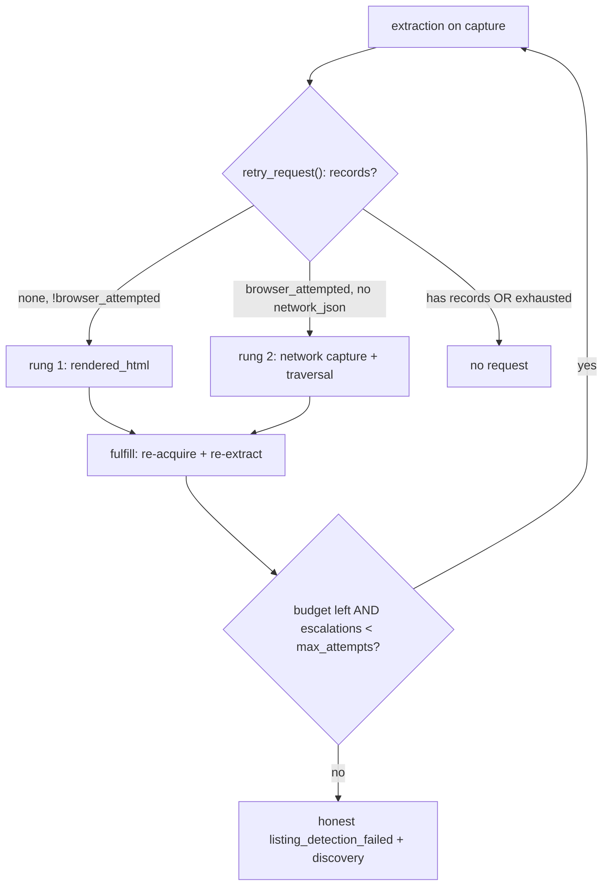

# Acquisition-Ladder Stream — Summary (for human review)

Stream: ACQUISITION-LADDER (with cross-cutting + extraction-cascade). Repo `/code/abhij1306/CrawlerAI`, base `main` (HEAD `4fc9d49`). Paths/symbols re-confirmed via `git ls-tree -r main` + `git grep`.

## Problem
Today's browser-retry escalation is single-rung and ecommerce-only. Job surfaces get no retry, so JS/XHR-rendered job boards produce zero cards and a *misleading* verdict. Four divergent card-counting/scoring implementations disagree (count ≠ readiness ≠ extract). Job listing reads only the raw `"html"` artifact (not rendered fragments) and applies no quality gate. Failure is dishonest: a verdict-string mismatch means `listing_detection_failed` never matches downstream checks, and zero-boundary-with-usable-capture is mislabeled `insufficient_input_bundle`.

## Goals
- **One surface-agnostic escalation ladder** for all four surfaces (Principle 4): rung 1 (HTTP → request rendered_html), rung 2 (browser attempted, zero evidence, no network_json → re-fetch with network capture + traversal), rung 3 (exhausted → honest `listing_detection_failed`, never a fake singleton).
- Persist captured XHR/GraphQL as `network_json` so the deterministic network floor can fire.
- Job listing reads rendered artifacts via a *shared* listing-HTML artifact-id list (not a jobs fork) and applies the commerce quality gate, parameterized by `surface_spec()` (jobs: off-host allowed, title+location/apply; no image/price requirement).
- Collapse the four card implementations into **one surface-aware owner**; make counting surface-aware (delete `del surface`); unify `card_count` accumulate-vs-replace.
- Browser readiness waits for repeated rows / explicit no-results / bounded timeout — a loading shell is never "ready".
- Add the missing traversal/readiness/ladder unit tests.

## Current architecture (verified)
- **Declare:** `extraction/result_building.py::retry_request` forks on `request.surface.value == "ecommerce_*"` strings → jobs never get a `RetryRequest`.
- **Contract:** `extraction/contracts.py::CapabilityRequest` — `reason` Literal has only 4 ecommerce-ish values; `max_attempts` hard-capped `Field(ge=1, le=1)`.
- **Fulfill:** `crawl/pipeline/retry/stage.py::retry_extraction_request_with_browser` → `_acquire_browser_retry_result` hard-caps at one escalation (`browser_escalation_count >= 1`), only sets `fetch_mode="browser_only"`.
- **Capture→bundle works:** `browser_capture.should_capture_network_payload` (surface-aware config in `core/config/network_capture.py`) → `browser_result_builder` → `acquisition_result.network_payloads` → `replay.request_from_acquisition_result` already maps to `network_json` `ArtifactRef`s. Gaps: capture isn't forced on per rung; `network_json` isn't persisted to disk; listing/jobs harvest doesn't consume it (extraction-cascade's job).
- **Verdict mismatch (P0):** `extraction_loop.py::UrlVerdict` Literal says `"listing_failed"` but `verdict.VERDICT_LISTING_FAILED == "listing_detection_failed"`.
- **Four card impls:** `traversal_card_counting.py`, `traversal_helpers.py`, `browser_readiness.py`, `extraction/listing.py`; config lives in `core/config/selectors.py::CARD_SELECTORS`.

## Proposed changes (workflow-level)
1. Fix verdict Literal + honest classification (`discovery` for usable-capture zero-boundary; `insufficient_input_bundle` only for blocked/error).
2. Rebuild `retry_request` to be capability-driven via `surface_spec()` so all four surfaces escalate; extend `CapabilityRequest.reason` (`listing_boundaries_missing`, `network_floor_missing`) and raise `max_attempts` to `le=2`.
3. Fulfill side: cap on `retry_request.max_attempts`; rung 2 adds network-capture + traversal overrides; preserve budget/deadline guard; loop rung1→rung2 in one URL pass.
4. Persist `network_payloads.json`; force network capture on rung 2 for all surfaces.
5. New `acquisition/listing_cards.py` = single surface-aware card owner; delete the duplicates; unify `card_count`; job listing reads shared `LISTING_HTML_ARTIFACT_IDS` + shared quality gate.
6. Readiness rejects loading/search shells.
7. `diagnose.json` v3 gains a discovery section (anchor counts, rejected-anchor reasons).

## Key design decisions
- **Capability-driven, not surface-string:** the ladder branches on `surface_spec()` facts (expects-many-records, browser-attempted, network_json-present), so one code path covers commerce+jobs, listing+detail.
- **No artifact-type enum change:** `ArtifactRef.artifact_type` already includes `network_json`; `required_artifacts` stays a free-form request vocabulary (`"network_payloads"`).
- **Shared listing gate, surface-parameterized:** reuse the commerce gate for jobs via `off_host_records_allowed` + previously-dead job-hub markers; do not fork.
- **Config stays data-only:** the card *logic* owner is a new `acquisition/listing_cards.py`; `core/config/selectors.py` keeps only selector data.
- **Per-surface verifiability:** the ladder code is surface-agnostic, but tests assert each of the four surfaces independently so slices can land behind separate per-surface gates.

## Blocking questions
See the detailed plan's report. Summary: (1) who owns the `contracts.py` `CapabilityRequest` edit (this stream vs extraction-cascade); (2) confirm `max_attempts` ceiling = 2; (3) whether the shared card owner is a new `acquisition/listing_cards.py` (recommended) or elsewhere; (4) ownership of the `extraction/jobs.py`+`listing.py` gate unification (overlaps extraction-cascade).
