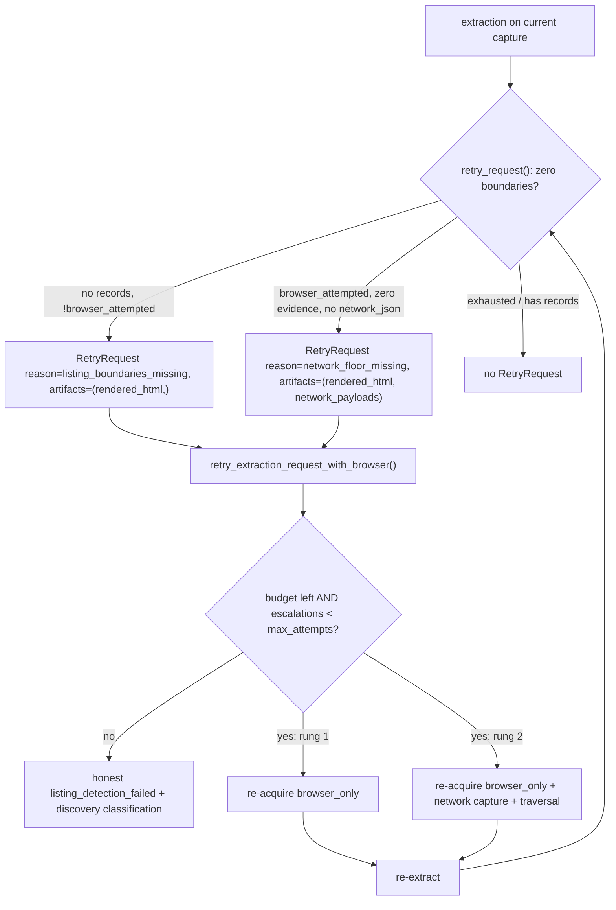

# Acquisition-Ladder Stream — Surface-Agnostic Escalation Loop, Network-JSON Floor, Honest Failure

Stream: ACQUISITION-LADDER (one of three: cross-cutting + extraction-cascade + this).
Repo: `/code/abhij1306/CrawlerAI`, base `main` (HEAD `4fc9d49`). Every path/symbol below re-confirmed via `git ls-tree -r main` + `git grep` at draft time.

Naming note: this plan names **functions/symbols**, not line numbers (brief line numbers have drifted). Re-locate with `git grep <symbol>` at build time.

Scope owned by this stream: the acquisition/pipeline/honest-failure machinery that FULFILLS capability requests the extraction cascade DECLARES — the surface-agnostic escalation ladder, network-payload capture+persistence so the network floor can fire, the unified card owner, browser readiness, honest failure taxonomy/verdict, and the missing unit tests. It does **not** own the cascade's internal harvest/floor logic (extraction-cascade stream) nor `SurfaceSpec` field additions (cross-cutting stream task 1) — it consumes both.

---

## Product / spec layer

### Goals & success criteria
- Replace the current single-rung, ecommerce-only browser retry with **one surface-agnostic escalation ladder** (Principle 4) that applies identically to all four surfaces:
  - **Rung 1** — extraction ran on an HTTP/non-browser capture (`!browser_attempted`) and found zero record boundaries → declare need for `rendered_html`; acquisition re-fetches with the browser.
  - **Rung 2** — browser was attempted, extraction still found zero evidence, and no `network_json` artifact was captured → declare need for network-payload capture + traversal/scroll; acquisition re-fetches with network capture and traversal enabled.
  - **Rung 3** — ladder exhausted → emit an **honest** `listing_detection_failed` verdict with `discovery` failure classification. Never fabricate a singleton success, never mislabel as `insufficient_input_bundle` when capture was usable.
- Persist captured XHR/GraphQL payloads as `network_json` artifacts so the deterministic network floor can fire (jobs data usually lives in API responses, not server HTML).
- Job listing reads **rendered** listing artifacts, not just the raw `"html"` artifact — via a unified listing-HTML artifact-id list shared with commerce, not a jobs-only fork.
- **One** card owner: card counting (traversal/readiness), listing readiness, and extraction card enumeration must agree (count == readiness == extract). Collapse the four divergent selector/scoring implementations into one surface-aware module. Fix the `card_count` accumulate-vs-replace inconsistency.
- Browser readiness waits for repeated rows / explicit no-results / a bounded timeout — a loading or search shell ("Searching…") is never treated as usable listing content.
- Add the missing unit coverage for traversal, readiness, and the retry ladder.

### Users / personas
- **Feedonomics (customer)**: crawls commerce + jobs, listing + detail. Job boards that render listings client-side or via XHR currently fail with a misleading verdict — this stream is the primary fix.
- **Internal operators**: read `diagnose.json` to understand *why* a URL produced zero records (anchor counts, rejected-anchor reasons, which rung the ladder reached).

### Expected behavior
- The ladder is driven by capability declarations, not surface strings. `retry_request(...)` (extraction) emits a `CapabilityRequest`/`RetryRequest`; `retry_extraction_request_with_browser(...)` (pipeline) fulfills it, re-acquiring with the declared capability and re-extracting.
- Each rung sets deterministic acquisition profile overrides (rung 1: `fetch_mode="browser_only"`, `prefer_browser=True`; rung 2: additionally enable network capture + traversal). Budget/deadline guards (`remaining_url_budget_seconds`) remain in force across all rungs.
- When the ladder cannot produce records, the verdict is `listing_detection_failed` (listing surfaces) or `empty` (detail), with a `discovery` failure classification whenever capture succeeded but zero boundaries were found.

### Non-goals
- Not rewriting the cascade harvest/floor internals — this stream ensures the *inputs* (rendered HTML, `network_json` artifacts, honest declarations) exist; the extraction-cascade stream consumes them.
- Not adding `SurfaceSpec` record-richness fields (cross-cutting task 1); this stream consumes `surface_spec()`.
- No new selector banks. The unified card owner reuses the existing `CARD_SELECTORS` config keyed by surface group.

### Acceptance criteria
1. `UrlVerdict` Literal in `extraction_loop.py` includes the real value `"listing_detection_failed"` (not the dead `"listing_failed"`), and every downstream string comparison matches `VERDICT_LISTING_FAILED`.
2. `retry_request(...)` produces a `RetryRequest` for **all four** surfaces on the rung-1 and rung-2 conditions, surface-agnostically (driven by `surface_spec()`/capability facts, no per-surface string forks for the decision).
3. `retry_extraction_request_with_browser(...)` executes up to `retry_request.max_attempts` rungs (not a hard cap of 1), enabling network capture + traversal on rung 2, while preserving the per-URL deadline guard.
4. Captured network payloads are persisted as `network_json` artifacts and appear in the extraction request bundle and in `diagnose.json`; the network floor can fire on a re-fetch.
5. `collect_job_listing` reads the unified listing-HTML artifact-id set (rendered fragments/visual HTML), not only `"html"`, and applies the same quality gate the commerce listing uses (strong-card, valid record URL, hub/chrome rejection).
6. Exactly one card enumeration+scoring owner exists; `count_listing_cards`, listing readiness, and the extraction card enumeration all call it; `del surface` is gone (counting is surface-aware). `card_count` has one uniform definition across scroll/load_more/paginate.
7. `wait_for_listing_readiness` returns "ready" only on repeated matching rows OR an explicit no-results marker OR a bounded timeout; a loading/search shell is classified as not-ready.
8. `diagnose.json` carries discovery diagnostics: candidate anchor counts and rejected-anchor reasons.
9. New unit tests cover the ladder rungs, traversal `card_count` semantics, and readiness shell rejection.

### Edge cases
- Browser already attempted on the first capture (e.g. user forced browser): rung 1 must not fire; ladder starts at rung 2. `_acquire_browser_retry_result` already skips when `PageEvidence.from_acquisition_result(...).browser_attempted` — rung 2 must instead re-acquire *with capture flags* even though browser was attempted, guarded only by budget + `max_attempts`.
- Budget exhaustion mid-ladder: `remaining_url_budget_seconds(context) <= 0` must stop escalation and fall through to honest failure, not raise.
- Network capture yields malformed/oversized payloads: persist only well-formed `network_json`; a zero-payload capture still counts as "browser attempted" so the ladder advances to exhaustion.
- Off-host job records (Greenhouse/Lever/Bullhorn): the quality gate must not reject a card solely for linking off-host — use `surface_spec().off_host_records_allowed` (cross-cutting task 1), not a hard same-site rule.
- `card_count` under paginate (fresh DOM per page) vs scroll/load_more (cumulative DOM): unify to "total unique cards observed across the traversal" so counts are comparable across modes.

---

## Architecture / design summary

### The escalation ladder
Two collaborators, one contract:
- **Declaring side** (`backend/app/extraction/result_building.py::retry_request`): inspects verdict + records + capture + evidence and returns a `RetryRequest` naming a `reason` and `required_artifacts`, or `None` at exhaustion. Today it forks on `request.surface.value == "ecommerce_*"` strings and never fires for jobs. Rebuild it to branch on **capability facts** (does the surface expect many records? did capture find zero boundaries? was the browser attempted? is any `network_json` present?), using `surface_spec()` — so one code path covers all four surfaces.
- **Fulfilling side** (`backend/app/crawl/pipeline/retry/stage.py::retry_extraction_request_with_browser` → `_acquire_browser_retry_result`): re-acquires with profile overrides driven by the request's `reason`/`required_artifacts`, then re-extracts. Today it hard-caps at one escalation (`context.browser_escalation_count >= 1`) and only sets `fetch_mode="browser_only"`. Change the cap to `context.browser_escalation_count >= retry_request.max_attempts` and add rung-2 overrides (network capture + traversal) when the declared `reason`/`required_artifacts` ask for network payloads.

### CapabilityRequest / RetryRequest contract change (shared with extraction-cascade)
`backend/app/extraction/contracts.py::CapabilityRequest` currently:
- `reason: Literal["dynamic_content_missing","empty_extraction","explicit_variants_missing","http_shell"]`
- `max_attempts: int = Field(default=1, ge=1, le=1)`

Required additions (this stream proposes the shape; **ownership of the edit is a blocking question** — see below):
- Extend `reason` with `"listing_boundaries_missing"` (rung 1: usable capture, zero record boundaries, browser not yet attempted) and `"network_floor_missing"` (rung 2: browser attempted, zero evidence, no `network_json`).
- Raise the `max_attempts` upper bound from `le=1` to `le=2` (two browser rungs is the ladder depth; rung 3 is "no request"). Keep `ge=1`, default `1`.
- `required_artifacts` stays `tuple[str, ...]`; rung 2 uses `("rendered_html", "network_payloads")` (the same string the ecommerce-detail branch already emits and that `_acquire_browser_retry_result` will interpret as "turn on network capture"). No `ArtifactRef.artifact_type` Literal change is needed — that Literal already includes `"network_json"`; `required_artifacts` is a free-form request vocabulary, not the artifact-type enum.

### Network-payload capture → `network_json` persistence
The capture path already exists and is surface-aware: `browser_capture.should_capture_network_payload(...)` uses `core/config/network_capture.ENDPOINT_TYPE_PATH_TOKENS` (has `job_listing` entries: `graphql`, `job_api: /jobs,/search,/postings,/requisitions`); `browser_result_builder` writes `capture_summary.payloads` into `acquisition_result.network_payloads`. `replay.request_from_acquisition_result → _bundle_from_runtime_inputs` already turns each `network_payloads` entry into an `ArtifactRef(artifact_type="network_json", artifact_id="network_{i}")` in the live extraction bundle. So the **capture→bundle** path works; the gaps are:
1. Network capture is only turned on for some surfaces/rungs — rung 2 must force it on for all surfaces via a profile override.
2. `network_json` artifacts are **not persisted to disk** for diagnostics: `persistence/url_result_artifacts.publish_url_result_artifacts` writes only `page.html`, `record.json`, `diagnose.json`. Add a `network_payloads.json` artifact (bounded) so a failed run is debuggable and the floor's inputs are inspectable.
3. Only `extraction/collectors/metadata.py` consumes `network_json` today (ecommerce detail). Making the **listing/jobs harvest consume `network_json`** (the network floor) is the extraction-cascade stream's job — this stream guarantees the artifact exists and is captured; coordinate.

### Job listing reads rendered artifacts + quality gate (unified, not a jobs fork)
`extraction/listing.py::collect_ecommerce_listing` iterates `ECOMMERCE_LISTING_HTML_ARTIFACT_IDS` (`html`, `rendered_listing_fragments`, `listing_visual_html`) and applies a quality gate (`strong_card`, `_valid_listing_product_url`, admissible-title / structural / category rejection). `extraction/jobs.py::_collect_job_listing_evidence` reads only `reader.document_store.html("html")` and gates only on `is_hidden()` + dedup — no strong-card, no URL validation, selectors end in bare `article`/`li`. The job-hub rejection markers exist in config (`core/config/extraction_rules/_listing_structured.py`: `JOB_LISTING_HUB_TITLE_PREFIXES/SUFFIXES`, `JOB_POSTING_PATH_MARKERS`, terminal suffixes) but have **zero consumers**.

Plan: rename `ECOMMERCE_LISTING_HTML_ARTIFACT_IDS` intent to a **surface-neutral** `LISTING_HTML_ARTIFACT_IDS` (keep the ecommerce alias re-exported to avoid breaking `browser_result_builder`/`replay` imports) and have `collect_job_listing` iterate the same artifact-id list. Lift the commerce quality-gate helpers into a shared listing-gate that both surfaces call, parameterized by `surface_spec()` (commerce requires image/price signal; jobs require title + location/apply-url, off-host allowed, and applies the job-hub markers). This is the biggest single fix for "jobs listing fails". **Ownership note:** this touches extraction harvest code that overlaps the extraction-cascade stream — see blocking question 4.

### One card owner (kill the four forks)
Four implementations disagree today:
1. `acquisition/traversal_card_counting.py`: `count_listing_cards` (uses `CARD_SELECTORS` by group), `_select_listing_fragment_nodes` (`del surface`, hardcoded selectors), `_base_listing_fragment_score`, `page_snapshot`.
2. `acquisition/traversal_helpers.py`: `_collect_listing_card_fragments` (`del surface`), `_listing_fragment_score` (duplicate hardcoded selectors + scoring).
3. `acquisition/browser_readiness.py`: `_ECOMMERCE_READY_CARD_SELECTORS`, `listing_card_signal_count`, `_ecommerce_ready_card_count`.
4. `extraction/listing.py` config-driven enumeration.

Config already centralizes selectors: `core/config/selectors.py::CARD_SELECTORS` (keys `ecommerce`, `article`, `jobs`) and `ECOMMERCE_READY_CARD_SELECTORS = CARD_SELECTORS["ecommerce"]`. Plan: create one module `backend/app/acquisition/listing_cards.py` (new) that owns surface-aware node selection + scoring + counting, reading `CARD_SELECTORS[group]` where `group` derives from `surface_spec()`. Rewrite the three acquisition consumers to call it; delete `_select_listing_fragment_nodes`, `_collect_listing_card_fragments`, `_base_listing_fragment_score`, `_listing_fragment_score`, `_ecommerce_ready_card_count`, and the `_ECOMMERCE_READY_CARD_SELECTORS` constant. Remove every `del surface`. **Location of the shared owner is a blocking question** (new `acquisition/listing_cards.py` vs extending `core/config/selectors.py` with logic — config should stay data-only per repo rule, so a new acquisition module is the recommendation).

### `card_count` uniform semantics
`traversal.py`: `_run_scroll_traversal` and `_run_load_more_traversal` set `result.card_count = int(current.get("card_count", 0))` (replace with the DOM's current cumulative total); `_run_paginate_traversal` does `result.card_count += current_count` (accumulate per page). Define `card_count` uniformly as **total unique cards observed across the traversal** and compute it through the unified counter's dedup (`page_snapshot` already distinguishes `unique_card_count` vs `raw_card_count`). Scroll/load_more read the cumulative unique count from the live DOM; paginate accumulates per-page unique counts. Assert the definition in tests.

### Browser readiness: no loading/search shells
`wait_for_listing_readiness` only waits for a platform-override selector in `state="attached"` with `listing_readiness_max_wait_ms` (default 6000) and returns "matched" on first `locator.count()`. It does not require *repeated* rows or distinguish a loading shell. `probe_browser_readiness` treats `listing_card_count >= listing_min_items` OR any matched selector as ready. Plan: strengthen readiness to require (a) ≥ `listing_min_items` *repeated* matching card rows via the unified counter, OR (b) an explicit no-results marker (add `LISTING_NO_RESULTS_MARKERS` to `core/config/selectors.py`), OR (c) bounded-timeout expiry — and classify a matched-but-single-node loading shell via the existing `looks_like_low_content_shell`/`classify_low_content_reason` as not-ready.

### Honest failure taxonomy + verdict
- P0 verdict-string mismatch: `extraction_loop.py::UrlVerdict` Literal ends in `"listing_failed"`; the real value from `verdict.VERDICT_LISTING_FAILED` is `"listing_detection_failed"`. Fix the Literal to the real value. The cast at the `verdict == VERDICT_EMPTY and "listing" in context.surface and persisted_count == 0` block already produces `VERDICT_LISTING_FAILED` — once the Literal matches, downstream comparisons stop silently failing.
- Honest classification: `engine._failure_classifications` returns `insufficient_input_bundle` when `target.status == "missing"` and no `evidence`, even if capture was usable. Change so `insufficient_input_bundle` is reserved for genuinely unusable capture (`acquisition_outcome in {"blocked","error"}` or `capture.blocked` — already handled earlier) and the zero-boundary-with-usable-capture case yields `discovery` (a `FailureTaxonomy` value that already exists). No new `FailureTaxonomy` literal is required.
- Never fake a singleton: the ladder returning `None` (exhausted) with zero records must not synthesize a record; verify no code path publishes a shell record for listing surfaces on exhaustion.

### diagnose.json discovery diagnostics
`observability/diagnose.py` (`SCHEMA_VERSION = "diagnose.v2"`, `build_diagnosis`, `_acquisition_section`) has no anchor/rejected-anchor data. Add a `discovery` section carrying candidate anchor counts and rejected-anchor reasons (fed from the unified card owner's rejection reasons and the listing gate). Bump `SCHEMA_VERSION` to `"diagnose.v3"` and extend `persistence/url_result_artifacts._shrink_diagnose_payload`/`_truncate_diagnose_list` limits for the new list. Coordinate the exact reason vocabulary with the extraction-cascade gate.

---

## Tasks

Tasks are ordered so the contract lands first, then the surface-agnostic ladder, then the shared owner, then readiness/diagnostics, then tests. Each task is a full vertical slice and is **verifiable per surface** (commerce listing / job listing / commerce detail / job detail) even though the ladder code is surface-agnostic — tests assert each surface independently so slices can land behind separate per-surface gates.

### 1. [parallel] Honest verdict + failure classification (P0, no new ladder behavior)
Scope: fix the verdict-string mismatch and the failure taxonomy so exhaustion is honest. This is independent of the ladder and unblocks per-surface verification.
- `backend/app/crawl/pipeline/extraction_loop.py`: change the `UrlVerdict` Literal member `"listing_failed"` → `"listing_detection_failed"`; keep the existing cast block (`verdict == VERDICT_EMPTY and "listing" in context.surface and persisted_count == 0 → VERDICT_LISTING_FAILED`).
- `backend/app/extraction/engine.py::_failure_classifications`: in the `target.status == "missing"` branch, return `discovery` whenever capture was usable (not blocked/error), reserving `insufficient_input_bundle` for the already-handled blocked/error/detail-shell cases. Do not add a new `FailureTaxonomy` literal (`discovery` exists in `contracts.py`).
- Verify no listing-surface path publishes a shell/singleton record on zero boundaries (`extraction/result_building.py`, `extraction/publication.py`).
Files: `backend/app/crawl/pipeline/extraction_loop.py`, `backend/app/extraction/engine.py`.
Test: new `backend/tests/unit/test_honest_verdict.py` — for each of the four surfaces, a zero-record usable-capture request yields verdict `listing_detection_failed` (listing) / `empty` (detail) and failure code `discovery`, and a blocked capture yields `insufficient_input_bundle`. `ruff check` both files.

### 2. [after 1] Surface-agnostic escalation ladder — contract + declare + fulfill (P0)
Scope: the core ladder. Land the contract change, rewrite the declaring side to fire for all surfaces, and lift the fulfill-side cap.
- `backend/app/extraction/contracts.py::CapabilityRequest`: add `reason` values `"listing_boundaries_missing"`, `"network_floor_missing"`; change `max_attempts` bound to `Field(default=1, ge=1, le=2)`. (Coordinate ownership per blocking question 1.)
- `backend/app/extraction/result_building.py::retry_request`: replace the `ecommerce_*` string forks with capability-driven logic using `surfaces.surface_spec(request.surface)`: (rung 1) surface expects records AND `not records` AND `not request.capture.browser_attempted` → `RetryRequest(required=True, reason="listing_boundaries_missing", required_artifacts=("rendered_html",), max_attempts=2)`; (rung 2) `not records` AND `request.capture.browser_attempted` AND no `network_json` in `request.capture.artifacts` → `RetryRequest(required=True, reason="network_floor_missing", required_artifacts=("rendered_html","network_payloads"), max_attempts=2)`; else keep existing detail-specific branches; else `None`. Keep the `http_shell` early return.
- `backend/app/crawl/pipeline/retry/stage.py`: in `_acquire_browser_retry_result`, change the hard cap `context.browser_escalation_count >= 1` to `>= <max from retry_request>` (thread `max_attempts` in), and add rung-2 profile overrides — when `required_artifacts` contains `"network_payloads"`, add `{"capture_network_payloads": True, "traversal_mode": <default>, "prefer_traversal": True}` to `profile_updates` (confirm the exact profile keys against `crawl/profile/normalization.py` + `crawl/profile/acquisition_contract.py`; use the existing `traversal_mode`/`required_network_payloads` keys). Preserve the `browser_attempted` early-skip for rung 1 only; rung 2 must proceed even though browser was attempted, guarded by budget + cap. Keep `remaining_url_budget_seconds` as `attempt_timeout_seconds`.
- `backend/app/crawl/pipeline/retry/stage.py::retry_extraction_request_with_browser`: loop the re-extract while the new `retry_result.retry_request` is required and budget/cap remain, so rung 2 can follow rung 1 in one URL pass.
Files: `backend/app/extraction/contracts.py`, `backend/app/extraction/result_building.py`, `backend/app/crawl/pipeline/retry/stage.py`.
Test: extend `backend/tests/unit/test_pipeline_browser_retry_budget.py` — assert two escalations now allowed (rung 1 then rung 2), rung 2 sets network-capture + traversal overrides, ladder stops at `max_attempts`, budget exhaustion halts escalation, original HTTP payload preserved on failure. New `backend/tests/unit/test_retry_request_ladder.py` — for each surface, assert rung-1/rung-2/exhaustion `RetryRequest` shapes (jobs now produce requests). `ruff check`.

### 3. [after 2] Network-payload capture-on-rung-2 + `network_json` persistence (P0)
Scope: guarantee rung-2 re-fetch captures network payloads and that they are persisted as `network_json` for the floor and diagnostics.
- Confirm the rung-2 profile override from task 2 actually enables `browser_capture` for all surfaces (trace `crawl/profile/acquisition_contract.py::build_acquisition_request` → `browser_fetch_runner._build_payload_capture(surface)` → `browser_capture.should_capture_network_payload`). If capture is gated behind a surface/endpoint check that excludes a surface, widen it via `core/config/network_capture.py` (it already has entries for all four surfaces — verify `job_detail`/`ecommerce_*` coverage).
- `backend/app/persistence/url_result_artifacts.py::publish_url_result_artifacts`: persist a bounded `network_payloads.json` artifact from `acquisition_result.network_payloads` (mirror `_persist_json` usage for `record.json`), so failed runs are debuggable. Do not change `record.json`/`page.html`.
- Verify `replay.request_from_acquisition_result` still maps `network_payloads` → `network_json` artifacts into the live bundle (it does today via `_bundle_from_runtime_inputs`); add a regression test.
Files: `backend/app/persistence/url_result_artifacts.py`, possibly `backend/app/core/config/network_capture.py`, `backend/app/acquisition/browser_fetch_runner.py` (only if a surface gate must widen).
Test: new `backend/tests/unit/test_network_json_persistence.py` — an acquisition result with `network_payloads` produces `network_{i}` `network_json` refs in the bundle (via `request_from_acquisition_result`) and a `network_payloads.json` artifact on disk (via a tmp artifacts dir). `ruff check`.

### 4. [after 1] Unified surface-aware card owner + job-listing rendered read + quality gate (P0/P1)
Scope: collapse the four card impls into one; make counting surface-aware; make job listing read rendered artifacts and gate quality; unify `card_count` semantics. This is the largest slice and is independently verifiable per listing surface.
- New `backend/app/acquisition/listing_cards.py`: owns `select_listing_card_nodes(document, *, surface)`, `score_listing_card_node(node, *, surface)`, `count_listing_cards(document_or_page, *, surface)` returning unique + raw counts and per-node rejection reasons. Reads `core/config/selectors.CARD_SELECTORS[group]` where `group` comes from `surface_spec()`. No `del surface`.
- Rewrite consumers to call it and delete the duplicates: `acquisition/traversal_card_counting.py` (`count_listing_cards`, `_select_listing_fragment_nodes`, `_base_listing_fragment_score`, `page_snapshot` internals), `acquisition/traversal_helpers.py` (`_collect_listing_card_fragments`, `_listing_fragment_score`), `acquisition/browser_readiness.py` (`_ecommerce_ready_card_count`, `listing_card_signal_count`, `_ECOMMERCE_READY_CARD_SELECTORS`).
- `backend/app/core/config/selectors.py`: keep `CARD_SELECTORS` data-only; keep `ECOMMERCE_READY_CARD_SELECTORS` alias.
- `card_count` uniform semantics in `acquisition/traversal.py`: route `_run_scroll_traversal`, `_run_load_more_traversal`, `_run_paginate_traversal` through the unified counter's unique count; define `card_count` = total unique cards observed across the traversal.
- Job listing rendered read + gate: rename `ECOMMERCE_LISTING_HTML_ARTIFACT_IDS` → surface-neutral `LISTING_HTML_ARTIFACT_IDS` in `core/config/extraction_recipes.py` (keep an `ECOMMERCE_LISTING_HTML_ARTIFACT_IDS` alias so `browser_result_builder`/`replay`/`listing.py` imports don't break); `extraction/jobs.py::collect_job_listing`/`_collect_job_listing_evidence` iterate `LISTING_HTML_ARTIFACT_IDS` via `reader.exists(...)` (mirror `listing.collect_ecommerce_listing`) and apply a shared listing gate. Extract the commerce gate helpers (`strong_card`, `_valid_listing_product_url`, admissible-title/structural/category rejection) into a shared function parameterized by `surface_spec()`; jobs consume the previously-dead hub markers from `_listing_structured.py` and honor `off_host_records_allowed`. (Ownership overlap with extraction-cascade — blocking question 4.)
Files: `backend/app/acquisition/listing_cards.py` (new), `backend/app/acquisition/traversal_card_counting.py`, `backend/app/acquisition/traversal_helpers.py`, `backend/app/acquisition/browser_readiness.py`, `backend/app/acquisition/traversal.py`, `backend/app/core/config/selectors.py`, `backend/app/core/config/extraction_recipes.py`, `backend/app/extraction/jobs.py`, `backend/app/extraction/listing.py`.
Test: new `backend/tests/unit/test_listing_cards.py` — surface-aware selection returns jobs cards for `job_listing` and product cards for `ecommerce_listing` from fixtures; scoring rejects nav/footer chrome; rejection reasons populated. New `backend/tests/unit/test_traversal_card_count.py` — scroll/load_more/paginate all yield the unique-total definition on a synthetic page sequence. Extend `backend/tests/unit/test_extraction_listing_behavior.py` and add `test_job_listing_gate.py` — job listing reads rendered fragments, rejects "Apply"/"Save" titles and hub links, keeps off-host records. `ruff check`.

### 5. [after 4] Browser readiness: reject loading/search shells
Scope: readiness requires repeated rows / explicit no-results / bounded timeout, using the unified counter.
- `backend/app/acquisition/browser_readiness.py::wait_for_listing_readiness` + `probe_browser_readiness`: require ≥ `listing_min_items` repeated card rows via `listing_cards.count_listing_cards`, OR an explicit no-results marker, OR bounded-timeout expiry; classify a single-node/loading match as not-ready via `looks_like_low_content_shell`/`classify_low_content_reason`.
- `backend/app/core/config/selectors.py`: add `LISTING_NO_RESULTS_MARKERS` (data-only) and export it.
Files: `backend/app/acquisition/browser_readiness.py`, `backend/app/core/config/selectors.py`.
Test: new `backend/tests/unit/test_browser_readiness.py` (with a fake page/document) — a "Searching…" single-node shell → not ready; ≥2 repeated rows → ready; explicit no-results marker → ready (empty but done); timeout → bounded not-ready. `ruff check`.

### 6. [after 4] diagnose.json discovery diagnostics
Scope: surface anchor counts + rejected-anchor reasons so operators can see why zero boundaries were found.
- `backend/app/observability/diagnose.py`: add a `discovery` section to `build_diagnosis` output carrying candidate anchor counts + rejected-anchor reasons from the unified card owner's rejection reasons (task 4) and the listing gate; bump `SCHEMA_VERSION` to `"diagnose.v3"`.
- `backend/app/persistence/url_result_artifacts.py`: extend `_shrink_diagnose_payload`/`_truncate_diagnose_list` for the new list so the artifact stays bounded.
Files: `backend/app/observability/diagnose.py`, `backend/app/persistence/url_result_artifacts.py`.
Test: extend `backend/tests/unit/test_diagnose_builder.py` — the discovery section carries anchor counts + rejection reasons; schema version is `diagnose.v3`; payload shrink keeps the list under the limit. `ruff check`.

### 7. [after 2,4,5] Ladder integration + traversal/readiness coverage
Scope: end-to-end unit/component coverage that the ladder + capture + gate + readiness work together per surface, filling the "traversal/readiness effectively untested" gap.
- New `backend/tests/component/test_escalation_ladder.py` — for each surface, drive a fake acquisition that returns an HTTP shell on rung 1, browser HTML with zero cards on rung 1 result, and network payloads on rung 2; assert the ladder advances rung1→rung2→success (records from network floor) or rung1→rung2→honest `listing_detection_failed`; assert budget guard stops escalation.
- Unit coverage for `traversal.py` step selection (scroll/load_more/paginate) and `traversal_recovery.py` if reachable without a browser.
Files: `backend/tests/component/test_escalation_ladder.py` (new), `backend/tests/unit/test_traversal_steps.py` (new).
Test: `pytest backend/tests/unit backend/tests/component -k "ladder or traversal or readiness or card or verdict or network_json"`; full `pytest backend/tests -k "not slow"` green; `ruff check backend/app`.

---

## Testing (summary)
- Per-task unit tests as listed; every acceptance criterion maps to at least one test.
- Per-surface verification: tasks 1, 2, 4, 7 assert each of the four surfaces independently, so a per-surface gate/slice can consume this stream incrementally.
- Final integration: `cd backend && pytest tests -k "not slow"` + `ruff check backend/app` green; a manual rung-2 smoke against a JS/XHR job board (e.g. a Greenhouse/Lever-hosted board) producing `network_json` artifacts and either real records or an honest `listing_detection_failed` with discovery diagnostics.

---

## Cross-stream dependency notes
- **Prereq (cross-cutting task 1):** `surface_spec()` must carry `record_signal_facts`, `min_record_signals`, `off_host_records_allowed` before tasks 2 and 4 can branch on capability facts instead of surface strings. Land cross-cutting task 1 first.
- **Contract (extraction-cascade):** the `CapabilityRequest.reason`/`max_attempts` change in task 2 is shared. The declaring side (`retry_request`) and the cascade's floor-consumption of `network_json` (listing/jobs harvest) live at the boundary between this stream and extraction-cascade — coordinate the edit of `contracts.py` and `extraction/jobs.py`/`extraction/listing.py`/`extraction/collectors/metadata.py`.
- **Gate (cross-cutting task 2/6):** per-surface selector deletion is gated by the eval harness; this stream's unified card owner and job-listing gate are the *replacement* that must beat baseline before the old jobs selector fork is deleted.
- **diagnose reason vocabulary:** task 6's rejected-anchor reason strings should match the extraction-cascade gate's grounding/rejection vocabulary.
