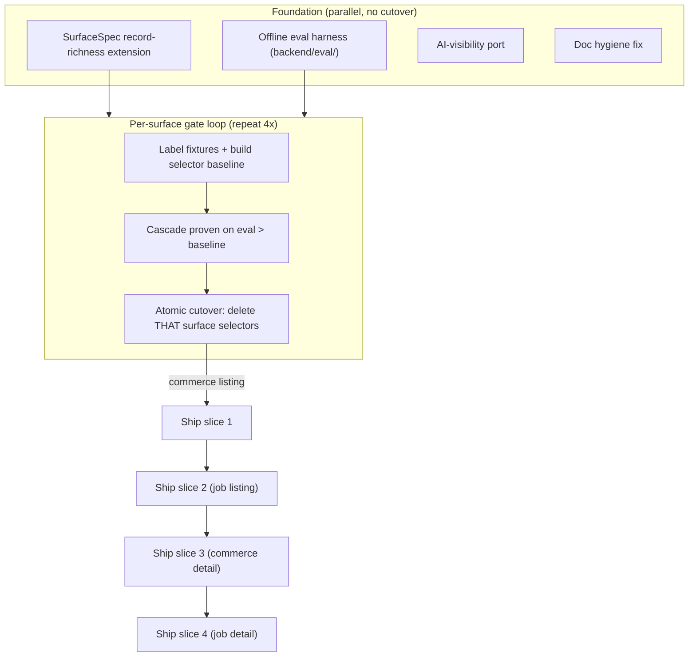

# Cross-Cutting Stream — Surface Schema, Eval Gate, Selector Deletion, AI-Visibility Port, Global Sequencing

Stream: CROSS-CUTTING (one of three: this + extraction-cascade + acquisition-ladder).
Repo: `/code/abhij1306/CrawlerAI`, base `main` (HEAD `4fc9d49`). All paths below verified via `git ls-tree -r main` / `git ls-tree -r origin/feature/extraction-v3-phase0-eval`.

Naming note: user-facing task text prefers function/symbol names; line numbers appear only as drift-prone hints — re-confirm with `git grep`/`git ls-tree` at build time.

---

## Product / spec layer

### Goals & success criteria
- Make `SurfaceSpec` (`backend/app/extraction/surfaces.py`) the single routing key so "a new surface = a typed schema, not a new pipeline" (Principle 5). No per-surface pipeline forks.
- Provide a deterministic, LLM-free **offline eval harness** that measures per-surface field precision/recall, a grounding/hallucination proxy, and listing repeated-boundary correctness. This is the **gate**: the generalized cascade must measurably beat the current selector baseline on a surface before that surface's selector code is deleted.
- Delete the brittle selector core **only after** its replacement is proven on eval — per surface, never wholesale.
- Port the AI-visibility feature verbatim from `origin/feature/extraction-v3-phase0-eval` (no extraction coupling).
- Define and enforce the global sequencing/rollout across all three streams: independently shippable, separately-gated surface slices; atomic per-surface cutover; no long-lived dual runtime.

### Users / personas
- **Feedonomics (customer)**: crawls commerce + jobs, listing + detail. Wants robust lean extraction.
- **Internal operators**: run the eval harness in CI to certify a surface before cutover.
- **AI-visibility users**: separate authenticated feature (brand-mention benchmarking), unrelated to extraction.

### Non-goals
- Not rewriting the cascade internals (that is the extraction-cascade stream) or the escalation ladder (acquisition-ladder stream). This stream owns the *contract* (SurfaceSpec), the *gate* (eval), the *deletion*, the *port*, and the *sequence*.
- Not deleting the working DOM-floor behavior. The selector deletion targets brittle CSS-selector banks and confirmed dead code, not the generalized discovery.
- No live/LLM calls in the eval harness CI path.

### Acceptance criteria
1. `SurfaceSpec` carries, per surface, the record-richness signals the cascade needs to distinguish real records from chrome (commerce: image+price/offer; jobs: title+location/apply-url, no image/price requirement). `surface_spec()` is the only lookup used by cascade/acquisition; no surface string branching for capability decisions.
2. Offline eval harness runs under `pytest` with zero network/LLM, produces per-surface precision/recall + grounding-failure proxy + listing boundary-count correctness, and compares a candidate run against a committed selector baseline. A surface's baseline exists (labeled fixtures committed) before its selector code is deleted.
3. Selector deletion is split per surface and each deletion PR references the eval report proving the cascade beats baseline for that surface. The live constant currently colocated with dead job constants is relocated to config before deletion, with no import breakage.
4. AI-visibility ports cleanly: backend module, api router, config, model, schema, 2 migrations chained onto main's alembic head, models `__init__` registration, `main.py` router include, frontend page + api client + route-registry entry, and all its tests pass.
5. Stale docs (`docs/CODEBASE_MAP.md`, `docs/backend-architecture.md`) extraction sections corrected to the real flat `backend/app/extraction/` layout.

### Edge cases
- `_jobs.py` is **not** fully dead: `SELECTOR_RUNTIME_PRIMARY_IFRAME_MAX_PAGE_TEXT` is consumed by `backend/app/core/records/selectors_runtime.py`. Must relocate before deleting the Oracle/Indeed constants, and prune the matching `_extra_exports.py` names.
- Migration chain: branch `20260711_0002` down_revision is `20260703_0001` = main's current single head. Chains cleanly — no rebase needed today. Re-verify at port time; if another migration has been merged to main's head in the meantime, rebase `20260711_0002.down_revision` onto the new head.
- No commerce-listing/jobs corpus exists today (branch captures: ~91/94 commerce-detail, 0 listing, 0 jobs). Per-surface fixtures must be authored, not harvested from existing captures, before a surface can be gated.
- AI-visibility `core/config/__init__.py` Settings change (gemini_api_key + anthropic alias) must be applied; main already imports `AliasChoices, Field` so no new import needed.

---

## Architecture / design summary

### SurfaceSpec as single routing key
`surfaces.py` already defines `Surface`, `SurfaceSpec`, `SURFACE_SPECS`, `COMMERCE_FACTS`, `JOB_FACTS`, `parse_surface`, `surface_spec`, `public_surface_for_internal`. This stream **extends** `SurfaceSpec` with an explicit record-richness signal set so the generalized cascade can gate real records vs chrome per surface without hard-coding commerce assumptions (the branch's fatal bug: `_is_content_rich` required image/price, which jobs lack). Add fields:
- `record_signal_facts: frozenset[str]` — facts whose presence marks a candidate as a genuine record for this surface (commerce: `offer.price`/`asset.url`; jobs: `job.location`/`job.apply_url`/`job.company`).
- `min_record_signals: int` — how many record-signal facts a candidate must carry to count.
- `off_host_records_allowed: bool` — jobs listings legitimately link off-host (Greenhouse/Lever/Bullhorn), so the discovery same-site requirement must be surface-driven, not hard-coded.

These are declarative additions consumed by the extraction-cascade stream; this stream owns only the schema + its unit tests, so the two streams share one contract.

### Eval harness as the gate
New `backend/eval/` package (name matches the branch's proven layout, rebuilt clean — do not `git checkout` the branch's eval code, which is coupled to the abandoned tiered/recipe architecture). Deterministic: labeled fixture HTML per surface + expected facts JSON; scorer computes per-field precision/recall, a grounding proxy (every emitted value must resolve to a substring/node present in the fixture — else counted as hallucination), and listing boundary correctness (expected record count vs produced). A committed baseline JSON per surface is produced by running the **current selector extractor** over the fixtures. The gate test fails cutover if a candidate run does not beat the baseline on that surface.

### Selector deletion (eval-gated, per surface)
Catalogue (verified consumers):
- `core/config/extraction_recipes.py`: `JOB_LISTING_*` banks consumed only by `extraction/jobs.py`; `ECOMMERCE_LISTING_*` banks consumed by `extraction/listing.py`, `acquisition/browser_result_builder.py`, `extraction/replay.py`. Delete per surface as its cascade replacement lands and beats baseline.
- `core/config/extraction_rules/_jobs.py`: Oracle HCM / Indeed constants — **dead** (only re-exported via `_extra_exports.py`, no runtime consumer). `SELECTOR_RUNTIME_PRIMARY_IFRAME_MAX_PAGE_TEXT` is **live** (selectors_runtime.py). Relocate the live constant to an appropriate `core/config/*` module, prune dead constants + their `_extra_exports.py` names.
- `core/config/extraction_rules/_listing_structured.py` job-hub markers (`JOB_LISTING_HUB_TITLE_PREFIXES/SUFFIXES`, `JOB_POSTING_PATH_MARKERS`, `JOB_LISTING_HUB_TERMINAL_SUFFIXES`, `JOB_LISTING_DETAIL_ROOT_MARKERS`): only re-exported via `_extra_exports.py`, never imported by runtime — dead. Delete markers + `_extra_exports.py` names when job surfaces cut over.
- `extraction/model_runtime.py` + `extraction/sentinel.py`: ecommerce-detail-only ML/challenger overhead but `engine.py` branch-checks `Surface.ECOMMERCE_DETAIL` for all requests. Simplify the all-surface branch checks once commerce-detail cascade lands; full removal only if the cascade subsumes it (coordinate with extraction-cascade stream).

### AI-visibility port
Verbatim `git checkout` of branch paths + wiring. All backend deps are core-only (`core.database`, `core.dependencies`, `models.user.User`, `core.config.product_intelligence.ADMIN_ROLE` — all present on main). Wiring diffs already known (models `__init__`, `main.py`, route-registry, config Settings).

### Global sequencing (see Sequencing section below).

---

## Tasks

### 1. [parallel] Extend SurfaceSpec with record-richness + off-host signals
Scope: add `record_signal_facts`, `min_record_signals`, `off_host_records_allowed` to `SurfaceSpec` in `backend/app/extraction/surfaces.py`; populate all four `SURFACE_SPECS` entries (commerce: image/price signals, same-site; jobs: location/apply/company signals, off-host allowed). Keep existing fields/API intact. This is the shared contract the extraction-cascade + acquisition-ladder streams consume — do not add surface-string branching anywhere.
Files: `backend/app/extraction/surfaces.py`; new `backend/tests/unit/test_surface_specs.py`.
Test: `pytest backend/tests/unit/test_surface_specs.py` — asserts every `Surface` has non-empty `allowed_facts`, `required_facts ⊆ allowed_facts`, `record_signal_facts ⊆ allowed_facts`, `min_record_signals ≥ 1`, jobs `off_host_records_allowed is True`, commerce `is False`. `ruff check backend/app/extraction/surfaces.py`.

### 2. [parallel] Build offline eval harness (deterministic, no network/LLM)
Scope: new `backend/eval/` package (rebuilt clean, NOT checked out from the branch):
- `backend/eval/__init__.py`
- `backend/eval/corpus.py` — load fixture HTML + label JSON pairs keyed by surface.
- `backend/eval/score.py` — per-field precision/recall; grounding proxy (each emitted value must appear as text in the source fixture else `hallucination += 1`); listing boundary correctness (produced record count vs labeled count, exact-match rate).
- `backend/eval/run.py` — run an extractor callable over a surface's fixtures, emit a report dict; `compare(candidate, baseline)` returns pass/fail per surface (candidate must be ≥ baseline on precision, recall, boundary correctness and ≤ baseline on hallucination).
- `backend/eval/fixtures/<surface>/*.html` + `backend/eval/labels/<surface>/*.json` — directory structure with `.gitkeep`; content authored in task 3.
- `backend/eval/reports/.gitkeep`.
- Config: any thresholds (min precision delta, grounding tolerance) go in `backend/app/core/config/evaluation.py` (new), per repo config rule.
Files: as above; new `backend/tests/unit/test_eval_harness.py` (uses 1–2 tiny inline fixtures to prove scorer math, grounding proxy, boundary counting — no real pages).
Test: `pytest backend/tests/unit/test_eval_harness.py` — deterministic scorer assertions (known TP/FP/FN → known precision/recall; a value absent from source → hallucination flagged; wrong record count → boundary fail). Runs with no network. `ruff check backend/eval`.

### 3. [after 2] Author per-surface fixtures + selector baselines (gate data)
Scope: for the surface being gated (repeat per slice, ordered per sequencing), commit a small labeled fixture set (target 5–8 pages/surface covering the record-rich and chrome-heavy cases) under `backend/eval/fixtures/<surface>/` + `backend/eval/labels/<surface>/`. Run the **current selector extractor** (`extraction/listing.py` for commerce listing, `extraction/jobs.py` for job surfaces, existing detail path for commerce detail) over the fixtures via `backend/eval/run.py` and commit the baseline report to `backend/eval/reports/baseline_<surface>.json`. Include the proven DOM-floor successes as fixtures where reproducible (dyson/arcteryx/ultipro listing HTML) so the bar reflects real wins. **This task must complete for a surface before that surface's selector deletion (task 6) is allowed.**
Files: `backend/eval/fixtures/<surface>/*`, `backend/eval/labels/<surface>/*`, `backend/eval/reports/baseline_<surface>.json`.
Test: `pytest backend/tests/unit/test_eval_baseline_<surface>.py` — loads the committed baseline and asserts the harness reproduces it from the fixtures deterministically (regression lock so baseline can't silently drift).

### 4. [parallel] Port AI-visibility feature verbatim
Scope: `git checkout origin/feature/extraction-v3-phase0-eval -- <paths>` for:
- `backend/app/ai_visibility/` (all 15 modules)
- `backend/app/api/ai_visibility.py`
- `backend/app/core/config/ai_visibility.py`
- `backend/app/models/ai_visibility.py`
- `backend/app/schemas/ai_visibility.py`
- `backend/alembic/versions/20260711_0002_ai_visibility_mvp.py`
- `backend/alembic/versions/20260711_0003_ai_visibility_benchmark_mode.py`
- `backend/tests/component/test_ai_visibility_api.py`, `backend/tests/component/test_ai_visibility_run_planner.py`, `backend/tests/component/test_ai_visibility_runner.py`
- `backend/tests/unit/test_ai_visibility_guardrails.py`, `test_ai_visibility_retry.py`, `test_ai_visibility_scoring.py`, `test_anthropic_ai_visibility.py`, `test_openrouter_ai_visibility.py`
- `frontend/app/ai-visibility/domain-workspace.tsx`, `frontend/app/ai-visibility/page-view.tsx`
- `frontend/src/api/ai-visibility.ts`

Then wire (do NOT checkout whole files for these — apply the exact diffs):
- `backend/app/models/__init__.py`: add `from app.models.ai_visibility import (AiVisibilityExecution, AiVisibilityProject, AiVisibilityRun)` and the three `__all__` entries.
- `backend/app/main.py`: add `from app.api.ai_visibility import router as ai_visibility_router` and add `ai_visibility_router` to the `include_router` loop list (after `product_intelligence_router`).
- `backend/app/core/config/__init__.py`: replace `anthropic_api_key: str = ""` with the `Field(default="", validation_alias=AliasChoices("ANTHROPIC_API_KEY","CLAUDE_API_KEY","anthropic_api_key"))` form and add the `gemini_api_key` Field (both from the branch diff; `AliasChoices`/`Field` already imported on main).
- `frontend/src/app/route-registry.ts`: insert the `ai-visibility` route object after the `product-intelligence` entry (uses existing `BrainCircuit` import — already present on main).

Verify migration chain: confirm `20260711_0002.down_revision == "20260703_0001"` and that `20260703_0001` is still main's single alembic head at port time (`cd backend && alembic heads`). If main's head has advanced, re-point `20260711_0002.down_revision` to the current head. Do NOT port `20260713_0004_compiled_recipe_compiler_version.py` (that is the abandoned compiler, not part of AI-visibility).
Files: as above.
Test: `cd backend && alembic upgrade head` on a scratch DB (chain applies); `pytest backend/tests/unit/test_ai_visibility_*.py backend/tests/component/test_ai_visibility_*.py`; `ruff check backend/app/ai_visibility backend/app/api/ai_visibility.py`; frontend `cd frontend && vp test` for any ai-visibility specs + `vp build` (route-registry lazy import resolves).

### 5. [parallel] Fix stale extraction docs
Scope: rewrite the extraction sections of `docs/CODEBASE_MAP.md` and `docs/backend-architecture.md` to the real flat `backend/app/extraction/` layout (engine.py, adapters.py, listing.py, jobs.py, surfaces.py, contracts.py, entities.py, targeting.py, resolution/, collectors/, model_runtime.py, result_building.py, validation.py, publication.py, pipeline.py, sentinel.py). Remove all references to the nonexistent `extract/` subpackage (`crawl_engine.py`, `listing_extractor.py`, `detail_extractor.py`, `structured_listing_handler.py`, `network_listing_mapper.py`, `extract/detail/*`, `extract/field_candidates/*`). Add SurfaceSpec-as-routing-key and the eval-gate rollout model.
Files: `docs/CODEBASE_MAP.md`, `docs/backend-architecture.md`.
Test: `grep -nE "extract/|crawl_engine|listing_extractor|detail_extractor|structured_listing_handler|network_listing_mapper" docs/CODEBASE_MAP.md docs/backend-architecture.md` returns nothing; every extraction path cited exists per `git ls-tree -r HEAD --name-only | grep backend/app/extraction`.

### 6. [after 3] Eval-gated per-surface selector deletion + live-constant relocation
Scope (repeat per surface, gated by that surface's task-3 baseline AND the extraction-cascade stream proving its cascade ≥ baseline on that surface's eval report):
- Relocate the LIVE constant `SELECTOR_RUNTIME_PRIMARY_IFRAME_MAX_PAGE_TEXT` from `core/config/extraction_rules/_jobs.py` to a durable config module (e.g. `core/config/selectors.py` or a new `core/config/selector_runtime.py`), update the import in `backend/app/core/records/selectors_runtime.py` and the `_extra_exports.py`/`__init__.py` export wiring. Do this once, before deleting job dead code.
- Delete dead code (no eval gate needed — 0 runtime consumers): Oracle HCM/Indeed constants in `_jobs.py`; job-hub markers in `_listing_structured.py`; prune their names from `_extra_exports.py` `_EXTRA_EXPORTS`.
- Per surface, once its cascade beats baseline: delete that surface's selector banks in `extraction_recipes.py` and the selector-consuming code path (`extraction/jobs.py` job banks; `extraction/listing.py` + `acquisition/browser_result_builder.py` + `extraction/replay.py` ecommerce banks), replacing consumers with the cascade entrypoint (coordinated with extraction-cascade stream).
- Simplify `engine.py` all-surface `Surface.ECOMMERCE_DETAIL` branch-guards around `model_runtime`/`sentinel` once commerce-detail cascade lands; full `model_runtime.py`/`sentinel.py` removal only if the cascade subsumes them.
Files: `core/config/extraction_rules/_jobs.py`, `core/config/extraction_rules/_listing_structured.py`, `core/config/extraction_rules/_extra_exports.py`, `core/config/extraction_rules/__init__.py`, `core/config/selectors.py` (or new module), `core/records/selectors_runtime.py`, `core/config/extraction_recipes.py`, `extraction/jobs.py`, `extraction/listing.py`, `acquisition/browser_result_builder.py`, `extraction/replay.py`, `extraction/engine.py`.
Test: after relocation, `python -c "import app.core.records.selectors_runtime"` and full `pytest backend/tests/unit backend/tests/component` import-clean; `grep -rn "ORACLE_HCM\|INDEED_DEFAULT\|JOB_LISTING_HUB_TITLE\|JOB_POSTING_PATH_MARKERS" backend/app` returns nothing after dead-code deletion; per-surface deletion PR must attach `backend/eval/reports/candidate_<surface>.json` showing cascade ≥ baseline; `ruff check` + `pytest backend/tests -k "not slow"` green.

---

## Global sequencing / rollout (across all three streams)

**Hard rule: no single monolithic all-surface cutover.** The branch failed precisely because two architectures ran live at once. Each surface is an independently shippable, separately-gated slice. No long-lived dual runtime — the selector path for a surface is deleted in the same slice its cascade replacement goes green.

**Recommended surface order** (each an atomic cutover for THAT surface only): commerce listing → job listing → commerce detail → job detail. Rationale: commerce listing has the proven DOM-floor wins (dyson/arcteryx/ultipro) so the first slice de-risks the cascade+eval machinery on known-good data; job listing next exercises the off-host/no-image signals that broke the branch; detail surfaces last because commerce-detail carries the model_runtime/sentinel legacy that only needs simplification after the listing cascade is trusted.

**Phase 0 — Foundation (this stream, parallel, no cutover):** tasks 1 (SurfaceSpec), 2 (eval harness), 4 (AI-visibility port), 5 (docs). AI-visibility ships immediately — it has zero extraction coupling and needs no gate.

**Phase 1..4 — one per surface, in order.** For each surface:
1. This stream task 3: author fixtures + commit selector baseline for the surface (MUST precede any deletion — there is no existing listing/jobs corpus, so the baseline data is created here).
2. extraction-cascade stream: build the generalized cascade for the surface; acquisition-ladder stream: supply the capabilities the cascade declares.
3. Gate: cascade run ≥ selector baseline on `backend/eval` (precision, recall, boundary correctness up; hallucination not up).
4. This stream task 6: atomic cutover — delete that surface's selector banks/paths in the same change, attach the passing eval report.

**Dead-code deletions** (Oracle/Indeed constants, job-hub markers, live-constant relocation) are ungated and can land in Phase 0 alongside the port, since they have zero runtime consumers / are pure relocation.

Never delete the working DOM floor before its cascade replacement is measured to beat it on that surface's eval report.

---

## Cross-stream dependency notes
- Task 1 (SurfaceSpec extension) is a **prerequisite contract** for the extraction-cascade and acquisition-ladder streams — land it first in Phase 0.
- Task 2 (eval harness) is a **prerequisite gate** for both other streams' per-surface cutover claims.
- Task 6 (deletion) is **[after]** the extraction-cascade stream proves each surface — this stream cannot delete unilaterally.
