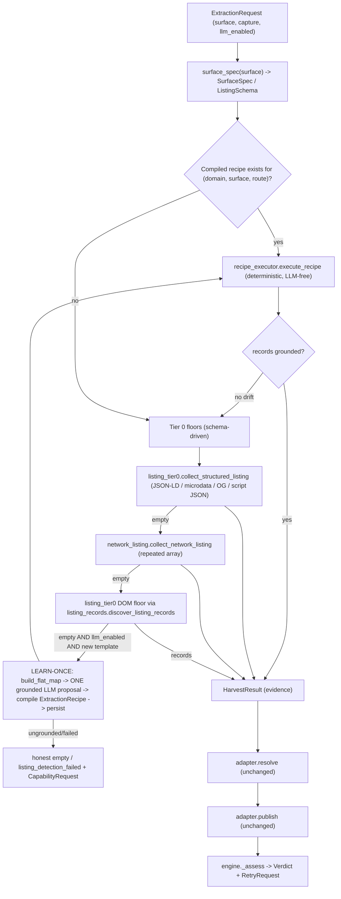
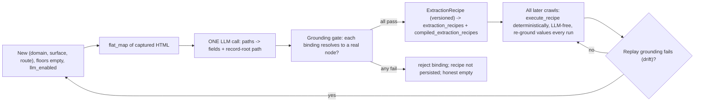

# Extraction Spine — Summary (Plan draft for main-agent review)

## Problem
`main`'s extraction is selector-bank driven and forks per surface. Commerce listing
(`extraction/listing.py`) has a real quality gate (`strong_card`, `_valid_listing_product_url`,
structural/category rejection); jobs (`extraction/jobs.py`) is a weaker clone that reads only the
raw `"html"` artifact and enumerates bare `article`/`li`/`a` with no gate. There is no
selector-free record discovery, no deterministic structured floor for listings, no network-JSON
floor, and no LEARN-ONCE mechanism. The only "learned" path (`model_runtime.py` +
`extraction_memory` contract runtime) is ecommerce-detail-only and CSS-recipe shaped.

The feature branch `origin/feature/extraction-v3-phase0-eval` proved the right primitives work
(dyson 14 / arcteryx 6 / ultipro 4 records, zero LLM, all via `listing_dom_floor`) but shipped two
competing architectures and a compiler that reverse-derived recipes from already-published records
(a hidden second producer). We port the branch's *primitives* onto `main`'s single
Harvest→Resolve→Publish spine, and reject its architecture.

## Goal
One shared, surface-agnostic cascade routed entirely by a typed `SurfaceSpec` (no `surface ==`
if/else in the cascade body), serving all 4 surfaces (commerce listing/detail, job listing/detail):

1. **Tier 0 structured floor** — JSON-LD / microdata / OpenGraph + embedded `<script>` JSON state,
   schema-typed per surface.
2. **Tier 0 network-JSON floor** — schema-driven repeated-array materialization from captured
   XHR/GraphQL (`network_json` artifacts).
3. **Tier 0 selector-free DOM boundary discovery** — repeated-container / record-local structure;
   the thing that produced the branch's zero-LLM successes.
4. **LEARN-ONCE LLM tier** — on a NEW (domain, surface) template with no deterministic result and
   LLM enabled, ONE grounded model call proposes which flat-map **paths** hold which fields (and
   the repeated record-root path for listings). A compiled, versioned recipe is persisted per
   (domain, surface, route). ALL later crawls replay the recipe deterministically, LLM-free. Values
   are always re-read and re-grounded from the page every run; the model never emits field values.
   Drift → recompile.

## Chosen approach (how it maps onto `main`)
- Extend the existing `SurfaceSpec` (`extraction/surfaces.py`) with the branch's typed listing lens
  fields (`structured_types`, `listing_optional_text_facts`, `listing_structured_fact_kinds`,
  `listing_network_fact_keys`) and add a `ListingSchema` derived from the spec plus a
  `listing_schema(surface)` helper. This is the single source of per-surface knowledge — a new
  surface is a new spec entry, not new pipeline code (principle 5).
- Add three new deterministic collector modules ported/rewritten from the branch:
  `extraction/listing_records.py` (selector-free boundary discovery),
  `extraction/listing_tier0.py` (structured + DOM floor), `extraction/network_listing.py`
  (network-JSON floor). All are schema-driven; none contain a `surface ==` branch.
- Add a shared `cascade` seam that both the listing adapters and (later) detail adapters call, so
  the *order* of tiers lives in one place. The engine keeps ownership of verdict/retry/metrics.
- The LEARN-ONCE tier is a new module set: a **discovery/compiler** that emits a
  `ExtractionRecipe` (ported `recipe_contracts.py` shape) from a grounded LLM proposal over the
  flat-map, a **replayer** (`recipe_executor.py` shape) that mechanically reads declared bindings,
  and a **persistence** layer reusing the existing `extraction_templates`/`extraction_recipes`/
  `compiled_extraction_recipes` tables. The compiler NEVER publishes records and NEVER reads
  published output — it reads only the capture bundle + flat-map (one-owner invariant).
- **Hard grounding gate** (already modeled in `model_runtime._grounded_evidence`): every
  model-derived binding must resolve to a real node/value on the page or it is capped
  uncertain/rejected — never trusted, never emitted as a value.

## De-commerce the discovery invariants (so jobs work)
The branch's discovery baked in commerce assumptions that rejected jobs. The ported discovery must:
- **No `same_site` requirement** for the record host — accept a consistent single foreign host
  (off-host ATS: Bullhorn/Greenhouse/Lever). `listing_records._consistent_record_host` already
  allows "all children share one host" (`hosts == {page_host}` OR `len(hosts) == 1`); keep and test
  the foreign-host branch explicitly.
- **No image/price requirement** for record-richness. Replace commerce `_is_content_rich`
  (image-or-currency) with a schema-driven per-surface record-signal set: repetition +
  structural homogeneity is the discriminator; jobs use title + detail-link + location/company
  presence, not price.
- **Anchor-less JS-onclick cards**: admit repeated structure with a stable record-local key even
  when the record has no `<a href>` (onclick navigation), using structural repetition + a
  record-local identity token.

## Contracts other plan streams depend on (stable seams)
- **`SurfaceSpec` / `ListingSchema` shape** (`extraction/surfaces.py`) — consumed by all collectors,
  targeting, and the LEARN-ONCE compiler. Frozen dataclass; a new surface = new dict entry.
- **`ExtractionResult` + `Verdict` seam** (`extraction/contracts.py`, `extraction/engine.py`) —
  unchanged public shape. `DiagnosticSummary.extractor_tier` gains `"llm"` (already in the Literal).
  Verdict is engine-owned; adapters/collectors never set it.
- **Recipe persistence model** — `ExtractionRecipe` pydantic contract (`extraction_recipe.v2`
  shape) stored via existing `extraction_recipes` / `compiled_extraction_recipes` rows keyed by
  `(domain, surface, route_pattern)` template. Compiler writes; replayer reads; no other writer.
- **Capability-request seam to acquisition** — `CapabilityRequest`/`RetryRequest`
  (`extraction/contracts.py`) is how extraction DECLARES needs (`rendered_html`,
  `network_payloads`) and acquisition FULFILLS them (`crawl/pipeline/retry/stage.py`). This must
  become surface-agnostic and support more than one escalation rung.

## Key design decisions
- **Reuse `main`'s Harvest→Resolve→Publish and the four adapters** rather than a parallel pipeline.
  The cascade is a new *harvest strategy* the adapters compose; Resolve/Publish/verdict are
  untouched. This is the single biggest guard against the branch's "two architectures" mistake.
- **Structured floor > network floor > DOM floor > LEARN-ONCE recipe > one-time LLM learn** is the
  fixed tier order, encoded once in the shared `cascade` module and gated by `SurfaceSpec` +
  `llm_enabled`.
- **Singleton admission only via structured corroboration** (branch invariant): DOM-only discovery
  stays repetition-gated (`_MIN_REPEATED_RECORDS = 2`); a single structured record is admissible
  because JSON-LD/microdata corroborates the boundary.
- **LEARN-ONCE is a separate producer from replay**: learning is the cold-path (LLM, once);
  replay + all floors are the hot path (deterministic). The compiler's only inputs are the capture
  bundle and the flat-map — it is structurally incapable of reading published records.

## Cascade data flow

## Recipe lifecycle

## Blocking questions
See the detailed plan file; there is one genuine architecture-fork question (recipe scope key /
LLM-learn autonomy) that the main agent should confirm with the user before Task 5 is built.

## UI/frontend note
This spine is backend-only. The AI-visibility port (separate stream) is the only user-facing
surface and needs the design handoff; the cascade itself does not.
